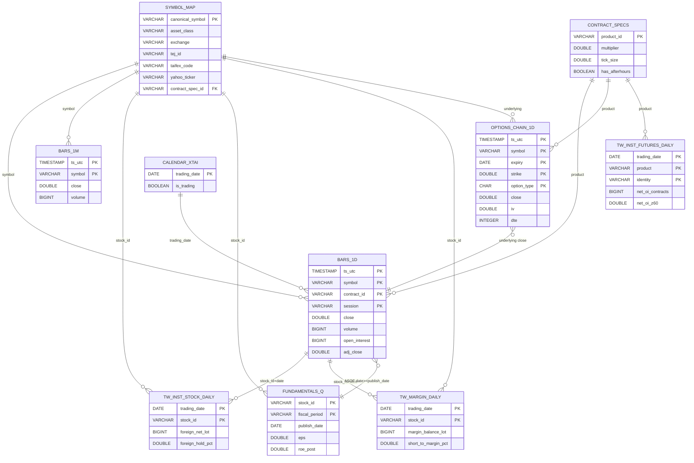

# QUANTDATA 資料庫架構設計

> 版本：v1.0
> 撰寫日期：2026-05-13
> 範圍：`/home/kevin/gs-scraper/QUANTDATA/` 下所有量化資料的儲存、組織、查詢與維運設計
> 目標讀者：策略研究員、量化開發工程師、資料工程師

---

## 目錄

- [1. 現況審視](#1-現況審視)
- [2. Stack 推薦](#2-stack-推薦)
- [3. 系統視覺化（Mermaid）](#3-系統視覺化mermaid)
- [4. 目錄架構（Medallion: Bronze → Silver → Gold）](#4-目錄架構medallion-bronze--silver--gold)
- [5. Canonical Schema](#5-canonical-schema)
- [6. DuckDB Catalog](#6-duckdb-catalog)
- [7. Ingest Pipeline 框架](#7-ingest-pipeline-框架)
- [8. 遷移路線（4 週）](#8-遷移路線4-週)
- [9. 即刻可動作清單](#9-即刻可動作清單)

---

## 1. 現況審視

### 1.1 規模與範圍

- **總量**：~825 GB、2,539 個檔案（含 2,373 個 parquet/CSV）
- **資產類別 7 大類**：
  - 台指期 / 小台（TXF / MXF）
  - TXO 選擇權
  - 台股現貨（TWSE / TPEX）
  - 台股期貨（168+ 檔個股期）
  - 台股 ETF / 指數
  - 美股期貨 / 指數 / ETF
  - FX / 商品 / 亞洲指數
- **時間範圍**：
  - 台股現貨：2010–2026（TEJ）
  - 台指期：2015–2026
  - TXO：2020–2026
  - US futures 1min（histdata）：2010–2024
  - US daily（yahoo）：2018–2026

### 1.2 既存問題（必須先修）

| # | 問題 | 證據 |
|---|------|------|
| **D1** | **完全重複檔案** | `MXF_1m_clean_all.parquet` 與 `MXF_1m_clean_all/MXF_1m_clean_all.parquet` MD5 相同（39 MB × 2）；`GC/*.parquet`（10 個年檔）與 `GC_1min_2010-2024/GC/*.parquet` 全部 MD5 相同（88 MB × 2） |
| **D2** | **未解壓 archives 與解壓內容並存** | `.zip / .rar / .7z` 共約 1.5 GB（含 `資料.rar` 364 MB、`股票期貨.zip` 115 MB、`NQ_1min_2010-2024.zip` 73 MB、`GC_1min_2010-2024.zip` 74 MB、`ES_1min_2010-2024.zip` 57 MB ...） |
| **D3** | **同資料 3 種介面並存** | TAIFEX 三大法人＝ ① `三大法人買賣超/taifex_total_table/*.csv`（cp950 + utf8 雙存）+ ② `SUPPLEMENT/TAIFEX/_bronze/*.csv`（2,187 個 per-day 檔）+ ③ `SUPPLEMENT/TAIFEX/foreign_oi_daily.parquet` 已聚合 |
| **D4** | **stock_futures_daily 與 _taifex 版本重複** | 21 vs 19 欄，相差 `name` / `underlying_code`；shared columns byte-identical。應只保留 enriched 版 |
| **D5** | **DATA_BY_SYMBOL/ vs NQ/、GC/、ES/ Schema 不一致** | 前者 18 欄含 `symbol/source_tier/quality_flag`（Yahoo sidecar，僅 7 天 sample）；後者 5 欄純 OHLCV + `timestamp` index（histdata 1min，2010–2024 完整）。**同 symbol 卻是不同來源、不同 schema** |
| **D6** | **日期 / 識別碼 / 編碼極度不一致** | 日期欄位名：`date / datetime / mdate / trade_date / 日期 / 交易日期`；型別：naive ts / UTC ts / `date` / `"2020/03/02"` 字串 / int `20100104`。Symbol：`coid / futures_code / stock_id / 證券碼 / symbol / vendor_symbol / product / _root` |
| **D7** | **無 reference 表** | 缺 `symbol_map`、`contract_specs`（multiplier / tick）、`trading_calendar` 規範化 |
| **D8** | **TXO tick parquet 有垃圾欄位** | `Unnamed: 20`、`Unnamed: 21` |
| **D9** | **TXO 1m 資料只有 1 個半月** | `TXO_1min_merged_20260310-20260422.parquet` 只覆蓋 2026/03/10–04/22 |
| **D10** | **無 point-in-time 欄位** | TEJ 財報有 `財報發布日` 但其他資料表沒 `ingestion_ts` / `available_from`，難做嚴格防 lookahead 回測 |

### 1.3 schema 抽樣摘要

| 資料 | 路徑 | 形狀 | 關鍵欄位 | 時間範圍 |
|------|------|------|---------|---------|
| TW MTX 1-min cleaned | `MXF_1m_clean_all.parquet` | (1,668,004, 15) | datetime, trading_date, session, open/high/low/close/volume, adj_* | 2020-03-02 ~ 2026-03-11 |
| TW MTX 1-day cleaned | `MXF_1d_clean_all.parquet/...` | (1,523, 12) | trading_date, open/high/low/close/volume, adj_* | 2020-03 ~ 2026 |
| TX continuous (TEJ) | `日k 期貨tquant lab/TX_continuous_adj_back.parquet` | (2,518, 32) | mdate, coid, due_m, settle, adj_factor, *_adj | 2016 ~ 2026 |
| Stock futures daily | `股票期貨/stock_futures_daily.parquet` | (3,382,429, 21) | date, futures_code, delivery_month, OHLCV, OI, session | 2015-01 ~ 2026-04 |
| Stock futures continuous | `股票期貨/continuous_near_month.parquet` | (539,992, 24) | + is_rollover, daily_return, is_abnormal_jump | 2015 ~ 2026 |
| TXO 1m merged | `TXO_1min_merged_20260310-...` | (2,193,096, 11) | trade_date, product_id, expiry_month, strike, option_type, OHLCV | 2026-03-10 ~ 04-22 |
| TXO tick (per-strike daily) | `選擇權日盤逐筆原始資料_TXO.parquet/...` | (2,684,014, 23) | 中文欄位、含垃圾 Unnamed 欄 | 2020-03-02 ~ 2026-04-01 |
| US futures 1min (histdata) | `NQ/2024.parquet` 等 | (~340K, 5) | OHLCV + timestamp index | 2010 ~ 2024 |
| TAIFEX foreign OI | `SUPPLEMENT/TAIFEX/foreign_oi_daily.parquet` | (2,187, 24) | product (MXF/TXF/TXO), dealer/inv/fii 多空 trade/oi | 2023-05-08 ~ 2026-05-08 |
| TEJ stock price | `TEJ資料/TWN_EWPRCD_股價.csv` | ~6.36M rows | 證券碼, 日期(int), 開盤/最高/最低/收盤價, 成交量(千股), 本益比, 除權息調整價 | 2010-01-04 ~ 2024 |
| TEJ inst (3 majors) | `TEJ資料/TWN_EWTINST1_三大法人.csv` | ~6.35M rows | 證券碼, 日期, 外資/投信/自營買賣超(千股), 持股率 | 2010-01-04 ~ 2024 |
| TEJ Q earnings | `TEJ資料/TWN_EWIFINQ_單季財報.csv` | ~101K rows | 證券碼, 財務資料日, 財報發布日, EPS, ROA/ROE, BS/IS/CF 全套 | 2010 ~ 2024 |
| TEJ margin | `TEJ資料/TWN_EWGIN_融資融券.csv` | ~3.5M rows | 證券碼, 日期, 融資/融券買賣張、餘額、使用率、維持率 | 2010 ~ 2024 |
| Institutional clean | `外資投信買賣超資料/institutional_clean.parquet` | (3,829,011, 13) | date, stock_id, foreign_net, sitc_net, dealer_net | 2012-05-02 ~ 2026-04-13 |

---

## 2. Stack 推薦

| 層 | 選型 | 原因 |
|---|---|---|
| **儲存格式** | **Parquet**（zstd level 3、dictionary、row-group 128 MB） | 列式壓縮、predicate pushdown、Polars / DuckDB / Spark / pandas 通吃；單機友善 |
| **目錄組織** | Hive-style 分區（`asset_class=… / symbol=… / year=…`） | DuckDB / PyArrow 自動 partition pruning |
| **查詢引擎** | **DuckDB** 0.10+ 為主 | 單檔 OLAP、Parquet native、SQL、毫秒級啟動、無 server；日線聚合幾百萬列 < 1 秒 |
| **轉換** | **Polars** lazy frame（> 10M 列）/ pandas（< 10M 列、報表） | Polars 比 pandas 快 5–20×、記憶體更省；舊 pandas notebook 仍能用 |
| **Catalog** | DuckDB `.duckdb` 檔（外掛 views 指向 silver / gold parquet） | 不需 Hive Metastore；要升級時 → PyIceberg + DuckDB iceberg extension |
| **Schema 驗證** | **Pandera**（lightweight、dataframe-level）+ pyarrow schema enforcement 在寫入時擋 | great-expectations 過重；pandera + pyarrow 已涵蓋 95% |
| **Ingest pipeline** | Python module per source（taifex / tej / yahoo / histdata）+ idempotent UPSERT + checksum log | 簡單、可測、可重跑 |
| **Orchestration** | 先 Makefile + systemd timer；資料源 > 8 個後升級 **Prefect 3** | open-source、native Python；Dagster 也可但學習曲線較陡 |
| **與 zipline-tej 整合** | 提供 `silver → zipline bundle` adapter（讀 silver parquet → zipline `tquant` ingest format） | 不改 zipline 內部 bcolz；用 silver 當 source of truth |
| **備份** | Bronze 不可變（每週 snapshot 到外接盤 / rclone → cloud）；silver / gold 可重生 | 3-2-1 規則 |

### 為什麼不用其他選項

- **PostgreSQL / TimescaleDB**：寫入快但 ad-hoc analytical query 較慢，且要維護 server、backup、權限——單人研究環境負擔不成比例。
- **ClickHouse**：適合 ≥ 1 TB 高基數、多 client 環境，過度設計。
- **ArcticDB**（Man Group）：很適合 quant，但鎖在自家二進位、生態小、與 zipline 對接需多寫一層。

### 為什麼是 DuckDB + Parquet

你的 workload 是「append-only、批量讀、複雜 SQL / Python join」——DuckDB 在這個 niche 是目前 SOTA。Polars 處理 streaming transform，DuckDB 處理 ad-hoc SQL，兩者互補。

---

## 3. 系統視覺化（Mermaid）

### 3.1 整體架構圖（系統視角）

從 **外部資料源 → staging → bronze → silver → gold → catalog → 消費端** 的端到端架構。`reference/` 表為 silver / gold 提供 symbol、合約規格、交易日曆 lookup。

```mermaid
flowchart LR
    subgraph EXT["外部資料源"]
        T1["TAIFEX<br/>三大法人 / 期權商品"]
        T2["TEJ API<br/>股價 / 法人 / 財報 / 融資券"]
        T3["TWSE / TPEX<br/>大盤 / 法人 / 融資"]
        T4["Yahoo Finance<br/>美股 / FX / 商品"]
        T5["histdata<br/>US futures 1m"]
    end

    STG["_staging/<br/>每日下載 inbox"]

    subgraph BR["bronze/ (不可變原始檔)"]
        B1[taifex/]
        B2[tej/]
        B3[twse/]
        B4[yahoo/]
        B5[histdata/]
    end

    subgraph SL["silver/ (canonical schema)"]
        S1["bars_1d / 1m / 5m / 1h"]
        S2["options_chain_1d / 1m"]
        S3["flows<br/>(inst / margin)"]
        S4["fundamentals<br/>(fin_q / fin_ttm)"]
        S5["macro<br/>(index / fx / rf)"]
    end

    subgraph GD["gold/ (research-ready)"]
        G1["features<br/>(txo / factor / cross)"]
        G2["continuous<br/>(tx / mtx / us)"]
        G3["universe"]
    end

    subgraph RF["reference/"]
        R1[symbol_map]
        R2[contract_specs]
        R3[calendar_xtai / us]
    end

    CAT[("catalog/<br/>quant.duckdb<br/>views + macros")]

    subgraph CN["消費端"]
        C1["zipline-tej<br/>bundle"]
        C2["Jupyter Notebook"]
        C3["回測引擎"]
        C4["/review-strategy"]
    end

    EXT --> STG
    STG --> BR
    BR -->|transform<br/>+ validate| SL
    SL -->|feature engineering| GD
    RF -.lookup.-> SL
    RF -.lookup.-> GD
    SL --> CAT
    GD --> CAT
    RF --> CAT
    CAT --> CN

    classDef extStyle fill:#fee2e2,stroke:#dc2626,color:#000
    classDef bronzeStyle fill:#fcd34d,stroke:#a16207,color:#000
    classDef silverStyle fill:#d4d4d8,stroke:#52525b,color:#000
    classDef goldStyle fill:#fde68a,stroke:#b45309,color:#000
    classDef refStyle fill:#bfdbfe,stroke:#1e40af,color:#000
    classDef catStyle fill:#bbf7d0,stroke:#15803d,color:#000
    classDef consStyle fill:#e9d5ff,stroke:#6b21a8,color:#000
    classDef stgStyle fill:#fed7aa,stroke:#c2410c,color:#000

    class T1,T2,T3,T4,T5 extStyle
    class B1,B2,B3,B4,B5 bronzeStyle
    class S1,S2,S3,S4,S5 silverStyle
    class G1,G2,G3 goldStyle
    class R1,R2,R3 refStyle
    class CAT catStyle
    class C1,C2,C3,C4 consStyle
    class STG stgStyle
```



---

### 3.2 Ingest 資料流圖（per-source pipeline）

每個外部 source 共用同一套 5-step pipeline，並把所有 side-effect（checksum、validation 失敗、lineage、audit）都寫到 `meta/`。

```mermaid
flowchart TB
    subgraph SRC["外部 Source"]
        direction TB
        SR1["TAIFEX HTML / CSV<br/>(cp950 encoding)"]
        SR2["TEJ API<br/>(utf-8 + 中文欄)"]
        SR3["Yahoo yfinance<br/>(JSON)"]
        SR4["histdata<br/>(1m OHLCV)"]
    end

    subgraph PIP["Ingest Pipeline<br/>(qd_ingest.sources.*)"]
        direction TB
        P1["1. discover()<br/>列出待抓檔"]
        P2["2. write_bronze()<br/>原貌寫盤<br/>+ SHA256<br/>+ manifest.jsonl"]
        P3["3. transform()<br/>欄名 → canonical<br/>cp950 → utf-8<br/>local → UTC<br/>千股 → lot"]
        P4["4. validate()<br/>pandera schema<br/>+ pyarrow types"]
        P5["5. upsert_silver()<br/>INSERT OR REPLACE<br/>+ audit log"]
    end

    subgraph META["meta/"]
        M1["audit/<br/>ingest_*.jsonl"]
        M2["lineage/<br/>bronze → silver"]
        M3["schema/<br/>*.schema.json"]
    end

    BR2[("bronze/<br/>*.csv / *.parquet")]
    SL2[("silver/<br/>*.parquet")]
    GD2[("gold/<br/>*.parquet")]

    SRC --> P1
    P1 --> P2
    P2 --> BR2
    P2 --> P3
    P3 --> P4
    P4 -->|pass| P5
    P4 -.fail.-> M1
    P2 -.checksum.-> M1
    P5 --> SL2
    P5 -->|每筆 row 帶 bronze_id| M2
    P5 -->|每次 run 一筆| M1
    M3 -.schema 校驗.-> P4

    SL2 -->|feature engineering<br/>(derived.py)| GD2

    classDef pipStyle fill:#e0f2fe,stroke:#0369a1,color:#000
    classDef storeStyle fill:#fef3c7,stroke:#a16207,color:#000
    classDef metaStyle fill:#f3e8ff,stroke:#7e22ce,color:#000
    classDef srcStyle fill:#fee2e2,stroke:#dc2626,color:#000

    class P1,P2,P3,P4,P5 pipStyle
    class BR2,SL2,GD2 storeStyle
    class M1,M2,M3 metaStyle
    class SR1,SR2,SR3,SR4 srcStyle
```

**關鍵不變量**

- Step 2 之後 bronze 寫完，pipeline 才能 fail-fast；bronze 不會因 transform 錯誤而少。
- Step 4 fail 不寫 silver、但寫 audit，保留 lineage 可追蹤。
- Step 5 對 silver 用 idempotent UPSERT（`PRIMARY KEY` 衝突→覆寫），重跑無副作用。

---

### 3.3 Silver / Reference 表關聯圖（ER）

主要 Silver 表的 PK 與外部關聯。三條虛線分別是 backtest 中最常用的 join：
1. **bars × inst_stock**：行情 join 個股法人籌碼
2. **bars ASOF fundamentals**：行情 join 財報，必須 `trading_date >= publish_date`（防 lookahead）
3. **options × bars underlying**：選擇權 join 標的 close 算 moneyness / IV



---

## 4. 目錄架構（Medallion: Bronze → Silver → Gold）

```
QUANTDATA/
├── _staging/                       # 下載 inbox（原始檔尚未驗證）
│   └── 2026-05-13/...
│
├── bronze/                         # 不可變原始檔（with provenance）
│   ├── taifex/
│   │   ├── inst_daily/product=TXF/year=2024/dt=2024-01-02.csv  (原 cp950)
│   │   ├── inst_daily/product=MXF/...
│   │   ├── inst_daily/product=TXO/...
│   │   ├── txo_chain_daily/year=2024/...
│   │   └── _manifest/manifest_2024.jsonl   (每檔 SHA256 / 抓取時間 / HTTP code)
│   ├── tej/
│   │   ├── stock_price/year=2024/...
│   │   ├── stock_inst/year=2024/...
│   │   ├── fin_q/year=2024/...
│   │   ├── fin_ttm/year=2024/...
│   │   └── margin/year=2024/...
│   ├── twse/
│   │   ├── fmtqik/year=2024/...        (大盤統計)
│   │   ├── bfi82u/year=2024/...        (三大法人台股)
│   │   └── margin_balance/year=2024/...
│   ├── yahoo/
│   │   ├── index/symbol=VIX/year=2024.csv
│   │   └── futures/symbol=NQ_F/year=2024.csv
│   └── histdata/
│       └── futures/symbol=NQ/year=2024.parquet
│
├── silver/                         # 標準化 typed canonical
│   ├── bars/
│   │   ├── bars_1d/asset_class=tw_futures/symbol=TXF/year=2024.parquet
│   │   ├── bars_1d/asset_class=tw_stock/year=2024/part-*.parquet     (HIVE)
│   │   ├── bars_1m/asset_class=tw_futures/symbol=MXF/year=2024.parquet
│   │   └── bars_1m/asset_class=us_futures/symbol=NQ/year=2024.parquet
│   ├── options/
│   │   ├── txo_chain_1d/year=2024/expiry=202403.parquet
│   │   └── txo_chain_1m/year=2026/expiry=202604.parquet
│   ├── flows/
│   │   ├── tw_inst_futures_daily/year=2024.parquet     (TAIFEX 三大法人 × TXF/MXF/TXO)
│   │   ├── tw_inst_stock_daily/year=2024.parquet       (TEJ 個股三大法人)
│   │   ├── tw_inst_market_daily/year=2024.parquet      (TWSE bfi82u)
│   │   └── tw_margin_daily/year=2024.parquet
│   ├── fundamentals/
│   │   ├── fin_q/year=2024.parquet                     (TEJ EWIFINQ 單季)
│   │   └── fin_ttm/year=2024.parquet                   (TEJ EWIFINQ 累季)
│   └── macro/
│       ├── tw_index_daily.parquet      (TAIEX, 0050, 0056, …)
│       ├── us_index_daily.parquet      (VIX, SPX, NDX, RUT, SOX, IRX, TNX)
│       ├── fx_daily.parquet            (USDTWD, DXY, EURUSD, JPY, CNY)
│       ├── commodity_daily.parquet     (CL, GC, HG, NG, SI)
│       ├── asia_index_daily.parquet    (HSI, N225, KS11, STI, 000001.SS)
│       └── rf_daily.parquet            (台灣無風險利率)
│
├── gold/                           # research-ready features
│   ├── features/
│   │   ├── txo_daily_features.parquet      (PCR、max-pain、IV proxy)
│   │   ├── cross_market_features.parquet   (NQ/ES ratio、VIX regime …)
│   │   └── stock_factor_daily.parquet      (momentum、value、low-vol …)
│   ├── continuous/
│   │   ├── tx_continuous_d.parquet         (TX 連續月 + adj_factor)
│   │   ├── mtx_continuous_d.parquet
│   │   ├── stock_futures_continuous_d.parquet
│   │   └── us_continuous_d.parquet         (ES/NQ/YM/RTY/GC)
│   └── universe/
│       ├── twse_universe_daily.parquet     (上市股票 master)
│       └── tw_futures_universe.parquet
│
├── reference/                      # 變動慢 / 半靜態
│   ├── symbol_map.parquet
│   ├── contract_specs.parquet
│   ├── calendar_xtai.parquet
│   ├── calendar_us.parquet
│   └── corporate_actions.parquet
│
├── catalog/
│   └── quant.duckdb                # 一個檔案：所有 view + 預編譯查詢
│
└── meta/
    ├── audit/                      # 每次 ingest 寫一筆 (table, rows, sha256, ts)
    ├── schema/                     # 每張表 .json schema (PyArrow)
    └── lineage/                    # which bronze → which silver row range
```

### 3.1 設計原則

1. **Bronze 不可變**：原始檔抓進來後永遠不動，只新增不刪改。所有 silver / gold 都能從 bronze 重建。
2. **Silver = 真理來源**：所有策略、報表、回測一律讀 silver 或 gold，不可讀 bronze。
3. **Gold = 預算好的研究 feature**：避免每次回測重算 PCR / max-pain / momentum 等高頻使用 feature。
4. **分區策略**：時間序列以 `year` 為主要分區（DuckDB 對 hive partitioning 支援好）；高基數 symbol（台股 2000+）用 file-per-symbol 或 hash partition。

---

## 5. Canonical Schema

### 統一約定（所有表都套用）

- `ts_utc TIMESTAMP NOT NULL`（事件時間，UTC，奈秒）
- `trading_date DATE NOT NULL`（交易所所在地的交易日，跨夜盤要對齊到隔日交易日）
- `source ENUM(...)` + `ingestion_ts TIMESTAMP`（point-in-time 用）
- `quality_flag ENUM('ok','gap','holiday','suspect','imputed','settlement')`
- Symbol 永遠用 `canonical_symbol`（先走 `reference.symbol_map`）

### 4.1 `silver.bars_1d` / `bars_1m` / `bars_5m` / `bars_1h` — 統一 OHLCV

```sql
CREATE TABLE silver.bars_1d (
  ts_utc          TIMESTAMP NOT NULL,
  trading_date    DATE NOT NULL,
  asset_class     VARCHAR NOT NULL,    -- 'tw_futures','tw_stock_futures','tw_stock','tw_etf','tw_index','us_futures','us_etf','us_index','fx','commodity'
  exchange        VARCHAR NOT NULL,    -- 'TAIFEX','TWSE','TPEX','CME','NYSE','ICE'
  symbol          VARCHAR NOT NULL,    -- canonical: 'TXF','MXF','2330','ES','VIX','USDTWD'
  contract_id     VARCHAR,             -- 'TXF202403' or NULL (連續/指數)
  session         VARCHAR NOT NULL,    -- 'day','ah','eth','rth'
  open            DOUBLE,
  high            DOUBLE,
  low             DOUBLE,
  close           DOUBLE,
  volume          BIGINT,
  open_interest   BIGINT,              -- NULL for stocks
  vwap            DOUBLE,
  settlement      DOUBLE,              -- futures/options only
  -- 調整後（除權息或 back-adjusted 連續）
  adj_open DOUBLE, adj_high DOUBLE, adj_low DOUBLE, adj_close DOUBLE,
  adj_factor      DOUBLE,
  -- meta
  source          VARCHAR NOT NULL,    -- 'tej','taifex','histdata','yahoo','sinotrade'
  ingestion_ts    TIMESTAMP NOT NULL,
  quality_flag    VARCHAR NOT NULL DEFAULT 'ok',
  PRIMARY KEY (asset_class, symbol, contract_id, session, ts_utc)
);
-- 分區: asset_class / symbol / year(ts_utc)
```

### 4.2 `silver.options_chain_1d` / `options_chain_1m` — TXO

```sql
CREATE TABLE silver.options_chain_1d (
  ts_utc         TIMESTAMP NOT NULL,
  trading_date   DATE NOT NULL,
  exchange       VARCHAR NOT NULL,     -- 'TAIFEX','CBOE'
  underlying     VARCHAR NOT NULL,     -- 'TX','SPX'
  symbol         VARCHAR NOT NULL,     -- 'TXO'
  expiry         DATE NOT NULL,
  expiry_code    VARCHAR,              -- '202403W1' 週別/月別
  strike         DOUBLE NOT NULL,
  option_type    CHAR(1) NOT NULL,     -- 'C' / 'P'
  session        VARCHAR NOT NULL,
  open DOUBLE, high DOUBLE, low DOUBLE, close DOUBLE,
  volume         BIGINT,
  open_interest  BIGINT,
  settlement     DOUBLE,
  best_bid       DOUBLE,
  best_ask       DOUBLE,
  -- 衍生 (silver-stage 即算好)
  moneyness      DOUBLE,               -- (S - K) / S
  dte            INTEGER,              -- days to expiry
  iv             DOUBLE,               -- 隱含波動率
  source VARCHAR, ingestion_ts TIMESTAMP, quality_flag VARCHAR,
  PRIMARY KEY (symbol, expiry, strike, option_type, session, ts_utc)
);
```

### 4.3 `silver.tw_inst_futures_daily` — TAIFEX 三大法人 × 商品

```sql
CREATE TABLE silver.tw_inst_futures_daily (
  trading_date   DATE NOT NULL,
  ts_utc         TIMESTAMP NOT NULL,        -- 結算/公告時間
  product        VARCHAR NOT NULL,          -- 'TXF','MXF','TXO','EXF','FXF',...
  identity       VARCHAR NOT NULL,          -- 'dealer','sitc','fii','dealer_self','dealer_hedge'
  long_trade_contracts   BIGINT, short_trade_contracts  BIGINT, net_trade_contracts BIGINT,
  long_trade_million     DOUBLE, short_trade_million    DOUBLE, net_trade_million   DOUBLE,
  long_oi_contracts      BIGINT, short_oi_contracts     BIGINT, net_oi_contracts    BIGINT,
  long_oi_million        DOUBLE, short_oi_million       DOUBLE, net_oi_million      DOUBLE,
  -- 滾動 z-score 預算好（z60 等），便於 backtest 直接用
  net_oi_z60     DOUBLE,
  source VARCHAR, ingestion_ts TIMESTAMP,
  PRIMARY KEY (product, identity, trading_date)
);
```

### 4.4 `silver.tw_inst_stock_daily` — TEJ 個股法人

```sql
CREATE TABLE silver.tw_inst_stock_daily (
  trading_date         DATE NOT NULL,
  stock_id             VARCHAR NOT NULL,
  exchange             VARCHAR NOT NULL,        -- 'TWSE' / 'TPEX'
  foreign_net_lot      BIGINT, sitc_net_lot BIGINT, dealer_net_lot BIGINT, total_net_lot BIGINT,
  foreign_buy_lot      BIGINT, foreign_sell_lot BIGINT,
  sitc_buy_lot         BIGINT, sitc_sell_lot    BIGINT,
  dealer_buy_lot       BIGINT, dealer_sell_lot  BIGINT,
  foreign_hold_lot     BIGINT, foreign_hold_pct DOUBLE,
  sitc_hold_lot        BIGINT, sitc_hold_pct    DOUBLE,
  dealer_hold_lot      BIGINT, dealer_hold_pct  DOUBLE,
  source VARCHAR, ingestion_ts TIMESTAMP,
  PRIMARY KEY (stock_id, trading_date)
);
-- 注意: TEJ "千股" 已換算成 "lot"（= 1000 shares）以對齊台股交易單位
```

### 4.5 `silver.fundamentals_q` — TEJ 單季 + 累季

```sql
CREATE TABLE silver.fundamentals_q (
  stock_id        VARCHAR NOT NULL,
  fiscal_period   VARCHAR NOT NULL,    -- '2024Q1'
  period_type     VARCHAR NOT NULL,    -- 'Q' (單季) / 'YTD' (累季)
  consolidated    BOOLEAN,
  currency        VARCHAR,
  publish_date    DATE NOT NULL,        -- 財報發布日 ← point-in-time 唯一可用日期
  -- profitability
  eps             DOUBLE, roa_pre DOUBLE, roe_post DOUBLE,
  gross_margin    DOUBLE, op_margin DOUBLE, net_margin DOUBLE,
  -- growth
  rev_growth      DOUBLE, gross_growth DOUBLE, op_growth DOUBLE,
  -- balance sheet (千元)
  total_assets BIGINT, total_liab BIGINT, total_equity BIGINT,
  current_assets BIGINT, current_liab BIGINT,
  -- income statement
  revenue BIGINT, cogs BIGINT, op_income BIGINT, net_income BIGINT, ni_to_parent BIGINT,
  -- cashflow
  cfo BIGINT, cfi BIGINT, cff BIGINT,
  source VARCHAR, ingestion_ts TIMESTAMP,
  PRIMARY KEY (stock_id, fiscal_period, period_type)
);
-- 回測 join 條件永遠是: bars.trading_date >= fundamentals.publish_date
```

### 4.6 `silver.tw_margin_daily` — TEJ 融資融券

```sql
CREATE TABLE silver.tw_margin_daily (
  trading_date          DATE NOT NULL,
  stock_id              VARCHAR NOT NULL,
  margin_buy_lot        BIGINT, margin_sell_lot BIGINT,
  short_buy_lot         BIGINT, short_sell_lot  BIGINT,
  margin_balance_lot    BIGINT, short_balance_lot BIGINT,
  margin_balance_ktwd   DOUBLE, short_balance_ktwd DOUBLE,
  margin_util_pct       DOUBLE, short_util_pct    DOUBLE,
  short_to_margin_pct   DOUBLE,
  margin_maint_pct      DOUBLE, short_maint_pct   DOUBLE, account_maint_pct DOUBLE,
  source VARCHAR, ingestion_ts TIMESTAMP,
  PRIMARY KEY (stock_id, trading_date)
);
```

### 4.7 `reference.symbol_map` — 解決 D6

```sql
CREATE TABLE reference.symbol_map (
  canonical_symbol   VARCHAR PRIMARY KEY,
  name_zh            VARCHAR,
  name_en            VARCHAR,
  asset_class        VARCHAR NOT NULL,
  exchange           VARCHAR NOT NULL,
  currency           VARCHAR,
  -- vendor IDs
  tej_id             VARCHAR,         -- '1101' / 'TXF202403'
  taifex_code        VARCHAR,         -- 'TX','MXF','TXO'
  yahoo_ticker       VARCHAR,         -- '^TWII','NQ=F','2330.TW'
  histdata_ticker    VARCHAR,         -- 'spxusd','nsxusd'
  bloomberg_ticker   VARCHAR,
  -- relationships
  underlying_symbol  VARCHAR,         -- for futures/options
  contract_spec_id   VARCHAR,
  active_from        DATE,
  active_to          DATE
);
```

### 4.8 `reference.contract_specs`

```sql
CREATE TABLE reference.contract_specs (
  product_id          VARCHAR PRIMARY KEY,   -- 'TXF','MXF','TXO','ES','NQ','GC'
  exchange            VARCHAR,
  multiplier          DOUBLE,                -- TXF=200, MXF=50, ES=50, NQ=20, GC=100
  tick_size           DOUBLE,                -- TXF=1, ES=0.25, NQ=0.25, GC=0.1
  tick_value          DOUBLE,                -- multiplier × tick_size
  currency            VARCHAR,
  session_open_local  TIME,
  session_close_local TIME,
  has_afterhours      BOOLEAN,
  ah_open_local       TIME,
  ah_close_local      TIME,
  settle_method       VARCHAR,               -- 'cash','physical'
  notes               VARCHAR
);
```

---

## 6. DuckDB Catalog

`catalog/quant.duckdb` 不存資料，只存 view + macro，全部讀 silver / gold 的 parquet：

```sql
-- 自動掃 silver
CREATE OR REPLACE VIEW bars_1d AS
  SELECT * FROM read_parquet('silver/bars/bars_1d/**/*.parquet', hive_partitioning=TRUE);

CREATE OR REPLACE VIEW txo_1d AS
  SELECT * FROM read_parquet('silver/options/txo_chain_1d/**/*.parquet', hive_partitioning=TRUE);

CREATE OR REPLACE VIEW inst_fut_daily AS
  SELECT * FROM read_parquet('silver/flows/tw_inst_futures_daily/*.parquet');

-- 預編譯巨集
CREATE MACRO continuous_tx(start, end) AS TABLE
  SELECT * FROM read_parquet('gold/continuous/tx_continuous_d.parquet')
  WHERE trading_date BETWEEN start AND end;

-- Point-in-time 安全 join 範例
CREATE OR REPLACE VIEW stock_with_fundamentals AS
SELECT b.*, f.eps, f.roe_post, f.publish_date AS fundamental_pub_date
FROM bars_1d b
ASOF LEFT JOIN read_parquet('silver/fundamentals/fin_q/*.parquet') f
  ON b.symbol = f.stock_id AND b.trading_date >= f.publish_date
WHERE b.asset_class = 'tw_stock';
```

### 5.1 在 notebook / script 中使用

```python
import duckdb
con = duckdb.connect('/home/kevin/gs-scraper/QUANTDATA/catalog/quant.duckdb', read_only=True)

# 取得 MXF 1min 2024 全年
df = con.sql("""
    SELECT ts_utc, open, high, low, close, volume
    FROM read_parquet('silver/bars/bars_1m/asset_class=tw_futures/symbol=MXF/year=2024.parquet')
    WHERE session = 'day'
    ORDER BY ts_utc
""").df()

# 個股 + 三大法人 join
df = con.sql("""
    SELECT b.trading_date, b.symbol, b.close, f.foreign_net_lot, f.total_net_lot
    FROM bars_1d b
    JOIN read_parquet('silver/flows/tw_inst_stock_daily/year=2024.parquet') f
      ON b.symbol = f.stock_id AND b.trading_date = f.trading_date
    WHERE b.asset_class = 'tw_stock' AND b.symbol = '2330'
""").df()
```

---

## 7. Ingest Pipeline 框架

```
src/qd_ingest/
├── __init__.py
├── cli.py                          # qd-ingest taifex --since 2026-05-01
├── common/
│   ├── checksum.py
│   ├── duckdb_io.py                # upsert helpers
│   ├── manifest.py                 # bronze → silver 行數對帳
│   └── validators/
│       ├── bars.py                 # pandera schema for bars_1d
│       ├── options.py
│       └── fundamentals.py
├── sources/
│   ├── taifex.py                   # bronze CSV → silver flows
│   ├── tej.py                      # bronze CSV → silver bars/fund/inst/margin
│   ├── twse.py                     # twse_bfi82u / fmtqik / margin
│   ├── yahoo.py                    # yfinance → bronze → silver bars
│   ├── histdata.py                 # 1m US futures
│   └── derived.py                  # gold features
└── tests/
```

### 6.1 每個 source 必須實作

```python
from typing import Protocol
import pyarrow as pa
from datetime import date

class IngestSource(Protocol):
    def discover(self, since: date) -> list["BronzeFile"]: ...
    def write_bronze(self, file: "BronzeFile") -> "BronzeRecord": ...    # 原貌寫盤 + SHA256
    def transform(self, bronze: "BronzeRecord") -> pa.Table: ...          # 轉 canonical schema
    def validate(self, table: pa.Table) -> "ValidationReport": ...        # pandera check
    def upsert_silver(self, table: pa.Table) -> "UpsertResult": ...       # 寫 silver + audit log
```

### 6.2 Idempotent 保證

任何時候重跑都得到相同結果：

- Pkey 衝突走 `INSERT OR REPLACE`（DuckDB 支援）或 staging-then-merge
- 每筆 bronze record 帶 SHA256，重複下載自動跳過
- 每次 ingest 寫一筆 `meta/audit/ingest_<date>.jsonl`：`{source, table, rows_in, rows_out, sha256, started_at, ended_at, status}`

### 6.3 範例：TAIFEX 三大法人 ingester

```python
# src/qd_ingest/sources/taifex.py
import pandas as pd, pyarrow as pa
from pathlib import Path
from datetime import date

IDENTITY_MAP = {'自營商': 'dealer_self', '自營商(避險)': 'dealer_hedge',
                '投信': 'sitc', '外資': 'fii', '外資及陸資': 'fii'}

def transform_taifex_inst(bronze_csv: Path) -> pa.Table:
    # bronze 是 cp950 + 中文欄名
    df = pd.read_csv(bronze_csv, encoding='cp950')
    df = df.rename(columns={
        '日期': 'trading_date',
        '商品名稱': 'product_zh',
        '身份別': 'identity_zh',
        '多方交易口數': 'long_trade_contracts',
        # ... 完整對應表
    })
    df['trading_date'] = pd.to_datetime(df['trading_date']).dt.date
    df['ts_utc'] = pd.to_datetime(df['trading_date']).dt.tz_localize('Asia/Taipei').dt.tz_convert('UTC')
    df['product'] = df['product_zh'].map({'小型臺指期貨': 'MXF', '臺股期貨': 'TXF', '臺指選擇權': 'TXO'})
    df['identity'] = df['identity_zh'].map(IDENTITY_MAP)
    df['source'] = 'taifex'
    df['ingestion_ts'] = pd.Timestamp.utcnow()
    return pa.Table.from_pandas(df[CANONICAL_COLS])
```

---

## 8. 遷移路線（4 週）

| 週 | 工作 | 產出 |
|---|---|---|
| **W1** | 清理 D1 / D2 重複檔；建 `reference.symbol_map`、`contract_specs`、`calendar_xtai`；寫好 8 張表的 pandera schema | 釋出 ~3 GB 重複空間；schema spec |
| **W2** | 寫 TEJ + TAIFEX + TWSE 三個 source ingester；產生 silver/bars/bars_1d、silver/flows、silver/fundamentals、silver/macro | TW 全套 silver 完成 |
| **W3** | 寫 histdata + yahoo source；產生 silver/bars/bars_1m（US）、silver/macro/us_*；建 gold/continuous（連續月） | US + 連續月就緒 |
| **W4** | 建 DuckDB catalog（views + macros）；寫 silver → zipline bundle adapter；GE-lite 對帳腳本；備份 cron | 可在 zipline-tej 直接 ingest；可在 notebook 用 `duckdb.connect("catalog/quant.duckdb")` |

---

## 9. 即刻可動作清單

W1 建議今天 / 本週就做：

1. **dedup 確認重複**：MD5 已比對相同的
   - `MXF_1m_clean_all/MXF_1m_clean_all.parquet`（保留 root 那份）
   - `GC_1min_2010-2024/`（保留 `GC/`）
2. **archive 歸位**：把 9 個未解壓 archives（`.zip / .rar / .7z`）移到外接硬碟或 `archive_originals/`；目錄裡只留解壓版。
3. **中文路徑英化**：把 `三大法人買賣超/`、`外資投信買賣超資料/`、`TEJ資料/`、`日k 期貨tquant lab/`、`台指期一分鐘/`、`股票期貨/`、`選擇權日盤逐筆原始資料_TXO.parquet/`、`加權指數日線_2020-2026.csv`、`無風險利率日資料_2019-2026.csv` 重新命名為英文 path（中文路徑會讓很多 CLI / CI 工具卡住）並 mv 到 `bronze/` 對應子目錄。
4. **baseline inventory**：跑一次 `find . -name "*.csv" -o -name "*.parquet" | xargs -I{} stat ...` 寫成 `meta/audit/asset_inventory.csv`，當作 bronze baseline。

---

## 附錄 A：與 zipline-tej 整合

zipline 用自家 bcolz / HDF5 bundle 格式，silver 不直接餵 zipline，而是寫一個 adapter：

```python
# tools/silver_to_zipline.py
import duckdb
from zipline.data.bundles import register
from zipline.data.bundles.core import most_recent_data

def silver_tquant_bundle(environ, asset_db_writer, minute_bar_writer, ...):
    con = duckdb.connect('catalog/quant.duckdb', read_only=True)
    # 1. 寫 asset metadata
    assets = con.sql("SELECT * FROM reference.symbol_map WHERE asset_class IN ('tw_stock','tw_etf')").df()
    asset_db_writer.write(equities=assets)
    # 2. 寫 daily bars
    for sym in assets['canonical_symbol']:
        df = con.sql(f"""
            SELECT trading_date AS date, open, high, low, close, volume
            FROM bars_1d
            WHERE asset_class = 'tw_stock' AND symbol = '{sym}'
            ORDER BY date
        """).df()
        daily_bar_writer.write([(sid, df)])

register('silver_tquant', silver_tquant_bundle, calendar_name='TEJ_XTAI')
```

然後 `zipline ingest -b silver_tquant` 就能用。

---

## 附錄 B：壓縮與儲存空間估算

| 表 | 原始大小 | Parquet+zstd 估算 | 壓縮比 |
|---|---|---|---|
| bars_1m（TW + US futures 全） | ~600 MB CSV | ~150 MB | 4× |
| bars_1d（TW 個股 2010–2026） | ~6.3M rows × 20 cols | ~80 MB | 8× |
| options_chain_1d（TXO 2020–2026） | 2.68M rows | ~150 MB | — |
| tw_inst_stock_daily | 3.8M rows | ~50 MB | — |
| fundamentals_q | 100K rows × 60 cols | ~30 MB | — |
| **silver 全部** | — | **~1.5 GB** | — |
| **gold 全部** | — | **~500 MB** | — |
| **bronze（保留原始）** | — | **~50 GB**（含 archive 解壓後） | — |

整理後可從 ~825 GB 縮到 **~55 GB**（bronze）+ **~2 GB**（silver+gold）。

---

## 附錄 C：版本與依賴

```toml
# pyproject.toml (建議)
[project]
requires-python = ">=3.11"

dependencies = [
    "duckdb>=0.10.0",
    "polars>=0.20.0",
    "pyarrow>=15.0.0",
    "pandas>=2.0.0",
    "pandera[polars]>=0.18.0",
    "pyyaml",
    "click",          # CLI
    "rich",           # 進度條
    "yfinance>=0.2.30",
]

[project.optional-dependencies]
orchestration = ["prefect>=3.0.0"]
zipline = ["zipline-tej"]    # 從 /home/kevin/gs-zipline-tej 安裝
dev = ["pytest", "ruff", "mypy"]
```

---

*文件結束*
