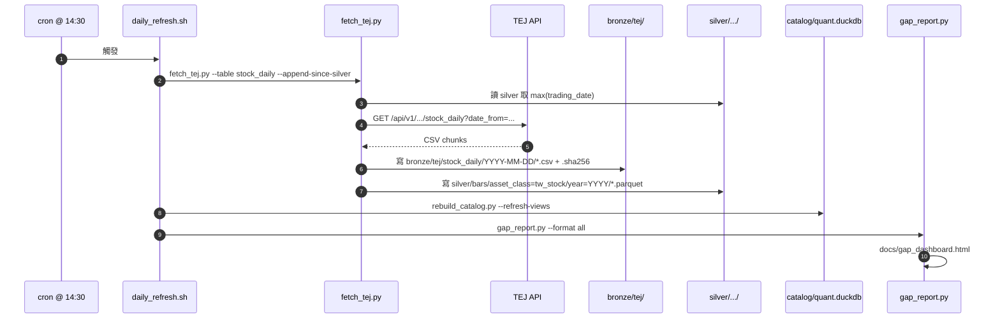
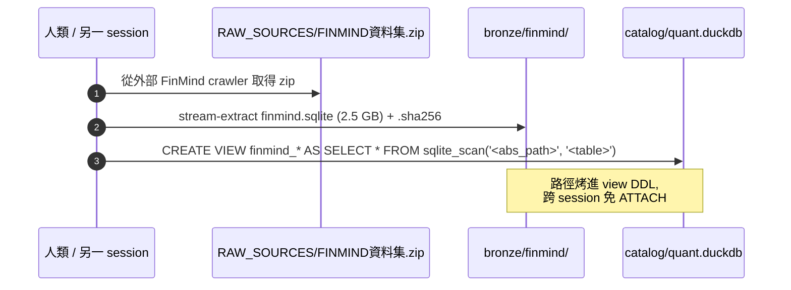
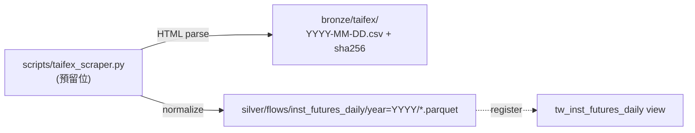
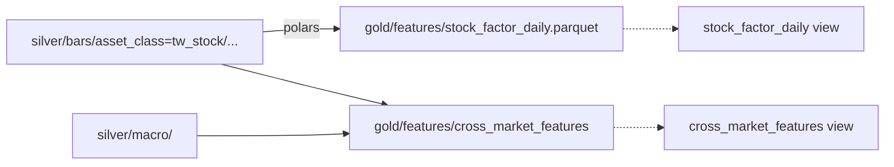

# 資料流

本頁把不同來源的「資料怎麼從 API / RAW 走到 DuckDB view」逐條畫出來。

## 1. TEJ — 日常增量（cron-driven）

最常見的資料流。每日 14:30 後 cron 觸發。



**關鍵設計：**

- `--append-since-silver` flag：fetch_tej.py 先 query silver 拿到最新日期，只抓那之後的；可重跑且 idempotent。
- bronze 寫入完才寫 silver，silver 寫入完才更新 catalog；任何一步炸了，前面的成果都還在。
- gap_report 是 read-only，最後跑只是為了讓 dashboard 顯示最新狀態。

## 2. FinMind — 一次性 snapshot



**為什麼用 view-over-sqlite 而非 ingest 進 silver：**

- 整個 sqlite 2.5 GB，10.6M 列。如果全 ingest 進 silver 會與 TEJ 大幅重複（2010+ 兩家 raw close bit-exact 重合）。
- 只有 2000-2009 段 + 興櫃 367 檔是 TEJ 沒有的；要 ingest 這段才划算（M8 deferred milestone）。
- view 路徑 baked-in 後，DuckDB 每次 query 直接 sqlite_scan，~~不用 ATTACH~~（DuckDB 1.5+ 對 sqlite scanner 效能足夠）。

詳見 [FinMind 整合頁](../db/finmind.md)。

## 3. TAIFEX 三大法人 — 直接落 silver

TAIFEX 的公開頁面只回最新一天，沒有歷史 API，scraper 設計上 bronze + silver 同步寫。



目前 TAIFEX 那套 scraper 沒被 daily_refresh 拉進來（見 gap_dashboard 顯示 13d STALE），靠人工或 TEJ 的 `AFINST` table 補位。

## 4. 美股 1min（histdata）— 一次性 bulk

```
RAW_SOURCES/NQ_1min_2010-2024.zip   (73 MB)
    ↓ 解壓
bronze/histdata/NQ/2010.parquet ~ 2024.parquet   (一年一檔)
    ↓ silver/bars/asset_class=us_future/symbol=NQ/year=YYYY/*.parquet
    ↓ register
bars_1m view（含 us_future segment）
```

完整資料表見 `DATA_ARCHITECTURE.md` § 5。

## 5. 派生因子（gold/）— silver delta-rebuild



預設**全量重算**而不是增量 update — 每次 silver 改動就重跑整段，反正單機跑也只要幾分鐘。增量 update 留給將來規模超過單機才需要。

## 6. 對帳（QC）— TEJ vs FinMind

```sql
CREATE VIEW qc_stock_price_diff AS
SELECT t.trading_date, t.symbol AS stock_id,
       t.close AS tej_close, f.close AS finmind_close,
       (t.close - f.close) / f.close AS pct_diff
FROM tw_stock_bars t
JOIN finmind_stock_price_norm f
  ON t.symbol = f.stock_id AND t.trading_date = f.trading_date
WHERE t.asset_class='tw_stock' AND t.close IS NOT NULL
  AND f.close IS NOT NULL AND f.close > 0;
```

每次 daily_refresh 完成後可選擇性跑 `SELECT * FROM qc_stock_price_diff WHERE ABS(pct_diff) > 0.001`；目前 6.37M 列只 2 列差 > 0.1%，視為 noise，未自動 alert。

詳見 [FinMind 整合頁](../db/finmind.md)。

## 7. 端到端 latency 概況

| 階段 | 典型耗時 | 瓶頸 |
|---|---|---|
| TEJ API 拉一日股價（~1,700 stocks） | 30-90s | 對方 rate-limit |
| 寫 bronze（CSV chunks） | < 5s | 本地 IO |
| silver normalize → parquet | 10-30s | polars cast + zstd encode |
| `rebuild_catalog --refresh-views` | < 3s | 只重寫 view DDL |
| `gap_report.py --format all` | 5-15s | 走遍 27 view 各 `SELECT MAX(date)` |

整段 daily_refresh.sh 通常 < 3 分鐘。bulk 補 1 年歷史 ~ 10-30 分鐘。
