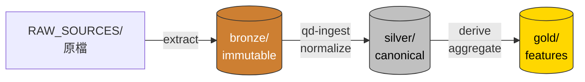

# Medallion 三層

QUANTDATA 採 **bronze → silver → gold** 三層架構。每層**只能**讀取上游、寫入本層、被下游讀取；不允許跨層直寫或環狀依賴。

!!! tip "搭配閱讀"

    本頁定義「每層放什麼」。要寫新 adapter 或做 code review 前，去看 [資料清洗準則](cleaning-criteria.md) — 那頁定義「promote 到下一層**之前**必須做完什麼」。



## Bronze — 不可變原始層

**目的**：永遠保留「最接近上游的原始狀態」。任何下游壞掉都能從 bronze 重建。

**規則：**

- 一旦寫入就不能修改、不能刪除（除非有人類批准的 retention policy）
- 每筆檔案必附 SHA256 sidecar：`finmind_2026-05-18.sqlite.sha256`
- 落地時間用 partition: `bronze/<source>/<dataset>/<YYYY-MM-DD>/...`
- 不做任何 schema normalize、欄名統一、型別轉換 — 就是把上游原樣放進來

**目前內容：**

```
bronze/
├── tej/        # TEJ subscription CSV + API dump
├── taifex/     # TAIFEX 公開頁面 scraper output
├── twse/       # TWSE 公開頁面 scraper output (預留)
├── yahoo/      # yfinance dump (預留)
├── histdata/   # NQ/ES/GC 1min parquet
└── finmind/    # finmind_2026-05-18.sqlite (2.5 GB) + .sha256
```

**典型操作：**

```bash
# 解壓某個 RAW_SOURCES 進來
.venv/bin/python -c "
import zipfile, hashlib
zp = '/home/kevin/gs-scraper/RAW_SOURCES/FINMIND資料集.zip'
with zipfile.ZipFile(zp) as z:
    z.extract('FINMIND資料集/data/finmind.sqlite', 'bronze/finmind/')
"

# 算 SHA256
sha256sum bronze/finmind/finmind_2026-05-18.sqlite \
  > bronze/finmind/finmind_2026-05-18.sqlite.sha256
```

## Silver — Canonical schema 層

**目的**：把 bronze 內**任何來源**的同類資料，統一到一份 schema、一個時區、一套命名規範。

**規則：**

- 欄位定義見 [Canonical schema](../db/schema.md)
- 時間：時區 aware `TIMESTAMP WITH TIME ZONE`（`ts_utc`） + 純日 `trading_date`
- Symbol：永遠 `VARCHAR`，本地約定（TWSE 4 碼數字、futures `TXFD4` 月份字尾、選擇權 `TXO20250620C12000`）
- 加 audit 欄：`source`（哪個 bronze 來的）、`ingestion_ts`（什麼時候寫進來）
- Hive-style 分區：`silver/bars/asset_class=tw_stock/year=2024/*.parquet`
- 寫入用 `INSERT OR REPLACE` 邏輯（partition 級別 overwrite，row 級別不行）

**目前內容：**

```
silver/
├── bars/          # asset_class={tw_stock, tw_future, tw_option, us_future, us_etf, ...}
├── flows/         # inst_stock_daily / inst_futures_daily / margin / chip_dist / large_trader
├── fundamentals/  # quarterly / monthly_revenue / accounting_raw / dividend
├── options/       # txo daily / per-strike
└── macro/         # taiex_daily, vix, usdtwd, ...
```

**典型查詢：**

```sql
-- silver 透過 catalog view 暴露
SELECT trading_date, symbol, close
FROM bars_1d  -- view over silver/bars/asset_class=*/year=*/*.parquet
WHERE asset_class='tw_stock' AND symbol='2330'
  AND trading_date BETWEEN '2024-01-01' AND '2024-12-31';
```

## Gold — Derived features 層

**目的**：把 silver 衍生成可被策略 / backtest 直接吃的特徵與 derived datasets。

**規則：**

- 只能從 silver 推；不直接讀 bronze
- 必須是 **deterministic**（同一份 silver → 同一份 gold）；不接 live API
- 變動頻率高的（每日 refresh 後重算）走 view；變動低的（要寫死的因子組）落 parquet
- 每張 gold 表都有 `source = 'qd_gold_<name>_v<n>'` 標明版本

**目前內容：**

```
gold/
├── features/
│   ├── stock_factor_daily   # 漲跌幅、RSI、ADX 等技術因子
│   ├── cross_market_features # VIX-vol corr、SPY corr 等
│   └── rs_rating_daily      # (規格 draft 完成，待實作；見 RS_Rating 規格頁)
├── continuous/
│   ├── tx_continuous_d      # 連續期 TX
│   ├── mtx_continuous_d     # 連續期 MTX
│   └── stock_futures_continuous_d  # 個股期連續近月
└── universe/                # 預留；篩選後的標的池
```

**典型衍生：**

```bash
# rebuild stock_factor_daily（依 tw_stock_bars）
.venv/bin/qd-ingest rebuild-stock-factors
```

## 邊界規則

| 違規例 | 為什麼不行 |
|---|---|
| Gold view 直接 JOIN bronze sqlite | 跳過 silver 標準化，下次 schema 改動會炸 |
| Silver 表加非標準欄名（中文欄名、空格欄名） | 下游 SQL 各種引用要 escape，破壞 canonical 約束 |
| Bronze 修改既有檔案 | immutable 違反；做法：寫入新檔案 + 新日期分區 |
| Silver 用「最新替換舊」沒留 history | 損毀回測 point-in-time correctness |

## Catalog 角色

`catalog/quant.duckdb` **本身不存任何數值資料**，只存 view DDL 與 macro 定義。所有 SELECT 都展開成對 parquet / sqlite 的掃描。檔案常駐 < 300 KB。

換言之，**砍掉 `catalog/quant.duckdb`，再重跑 `scripts/rebuild_catalog.py` 就能完整重生**。資料安全完全靠 bronze 的不可變性 + silver 的可重生性。
