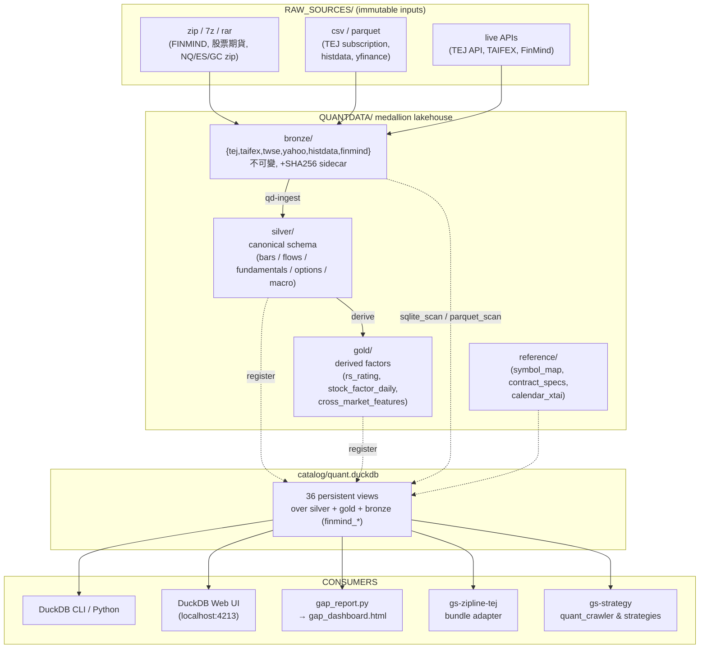

# 系統地圖

QUANTDATA 是一個 **「單機 medallion lakehouse」**：從多來源原始檔抽取 → 落 immutable bronze → 標準化 silver → 派生 gold features → DuckDB catalog 暴露 SQL 介面。
不執行交易、不做策略運算（那是 `gs-strategy/` 與 `gs-zipline-tej/` 的事）；本系統只負責 **「資料怎麼來、怎麼存、怎麼查」**。

## 系統地圖

## 三層分工

| 層 | 路徑 | 角色 | 核心抽象 |
|----|------|------|----------|
| **Bronze（immutable raw）** | `bronze/{tej,taifex,twse,yahoo,histdata,finmind}/` | 不可變原始檔；每筆都附 SHA256 sidecar；重組任何時候可從這層重建 | `(source, ingestion_ts, file_path, sha256)` 為主鍵 |
| **Silver（canonical schema）** | `silver/{bars,flows,fundamentals,options,macro}/` | 統一欄名 / 型別 / 時間語意；Hive-style 分區 `asset_class=... / symbol=... / year=...` | `ts_utc / trading_date / asset_class / exchange / symbol / contract_id / session / OHLCV / source / ingestion_ts` |
| **Gold（research-ready）** | `gold/{features,continuous,universe}/` | 衍生特徵與 derived datasets；可由 silver 完整重生 | factor name + `trading_date + symbol` 主鍵 |
| **Catalog** | `catalog/quant.duckdb` | DuckDB 檔；只存 view DDL 與 macros，**不存資料**（資料留在 parquet / sqlite） | 36 個 persistent views，跨 session 可直接查 |
| **Reference** | `reference/` | 不可變靜態維度表：symbol_map / contract_specs / calendar | parquet |
| **Meta** | `meta/audit/` | ingest manifest / 對帳 log / freshness snapshot | jsonl |

抽象的目的：**「同一個 silver schema，下游不關心是 TEJ 還是 FinMind 餵的資料」** — 例如把 FinMind 2000-2009 補進 silver，下游所有 view、所有 backtest 都不用改 code。

## 工作流線

| 流線 | 觸發 | 範圍 |
|----|------|------|
| **每日 refresh** | `scripts/daily_refresh.sh` (cron 每日盤後) | TEJ API 增量抓 → bronze → silver delta → 重建受影響 view → 跑 gap_report |
| **手動 bulk ingest** | `qd-ingest` / `fetch_tej.py` | 補歷史段、新增 dataset、整段重抓 |
| **快照式 ingest** | 人工把 `RAW_SOURCES/*.zip` 解進 bronze | FinMind sqlite snapshot、histdata 美股 1min 等一次性大檔 |
| **freshness 監控** | `scripts/gap_report.py` | 走遍 catalog，計算每張 view 的 lag，輸出 text / json / html |

詳細路徑見 [資料流](dataflow.md) 與 [Medallion 三層](medallion.md)。

## 兩條相關但獨立的 repo 線

| 線 | 角色 | 對 QUANTDATA 的依賴 |
|----|------|------|
| `gs-strategy/` | 策略原始碼 + 論文爬蟲 | 透過 `catalog/quant.duckdb` 讀 silver / gold；不寫 |
| `gs-zipline-tej/` | 回測引擎（Zipline-TEJ fork） | 透過 silver → bundle adapter 讀 OHLCV；不寫 |

QUANTDATA 是它們共同的「資料源 of truth」。
