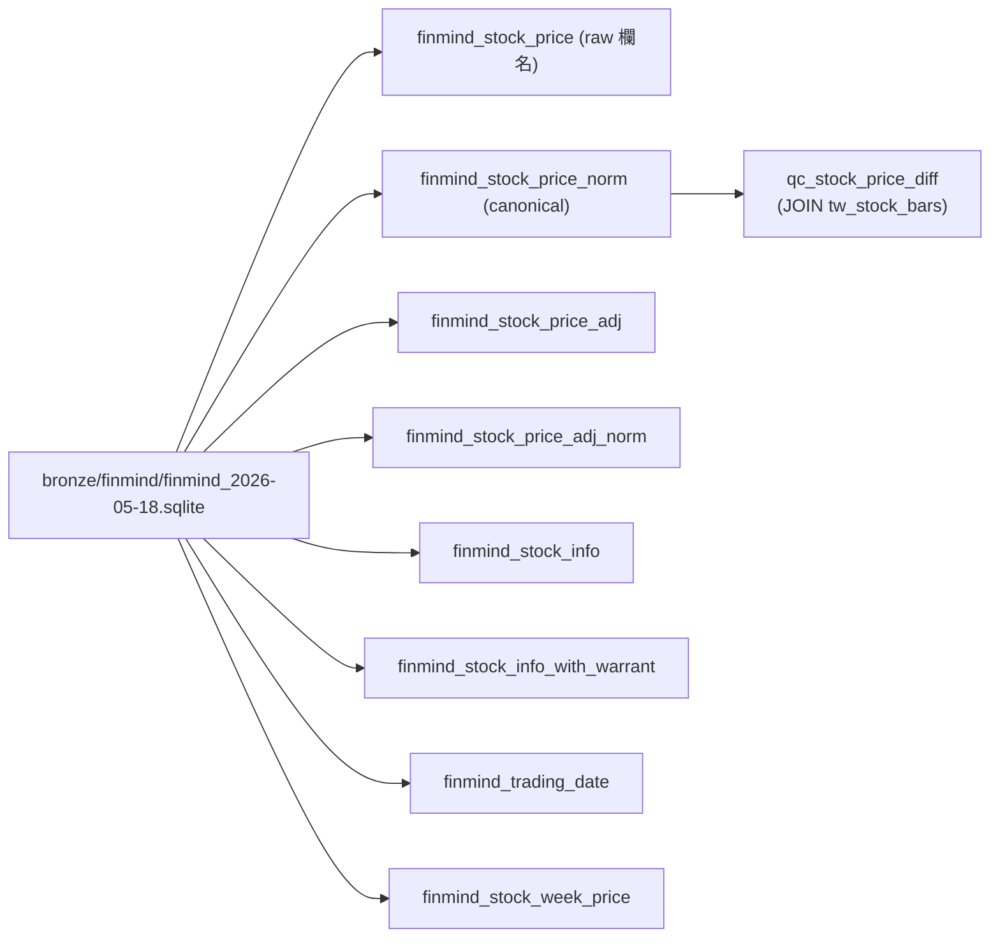

# FinMind 整合

QUANTDATA 在 2026-05-18 把一份 FinMind crawler 的 SQLite snapshot 接進 catalog。**目的不是取代 TEJ，而是補洞**。

## 為什麼接 FinMind

| 缺口 | FinMind 補了什麼 |
|---|---|
| TEJ 從 2010 開始，沒有 2000-2009 | 提供 2000-01-04 ~ 2009-12-31、1,477 檔台股 OHLCV |
| TEJ universe 沒有興櫃 | 多 367 檔 emerging board 股票 |
| 沒有獨立還原權息序列做 QC | 提供 `taiwan_stock_price_adj`（FinMind 自己的還原方法）做 cross-check |
| 沒地方查 TEJ 是否有錯 | 提供 `qc_stock_price_diff` view 做日級對帳 |

## 如何接

**不 ingest 進 silver**，而是用 DuckDB 的 `sqlite_scan(<abs_path>, <table>)` 把 sqlite 路徑直接烤進 view DDL：

```sql
CREATE VIEW finmind_stock_price AS
SELECT * FROM sqlite_scan(
    '/home/kevin/gs-scraper/QUANTDATA/bronze/finmind/finmind_2026-05-18.sqlite',
    'taiwan_stock_price'
);
```

**好處：**

- 不重複 10.6M 列資料；磁碟省 ~500 MB
- 不必每 session 先 `ATTACH`；路徑 baked-in
- 跟其他 view 一樣 `SELECT * FROM finmind_*` 就能查

**代價：**

- sqlite scanner 比 parquet 慢（DuckDB 1.5+ 已可接受，10M 列全掃 ~3s）
- view 強依底層 sqlite 檔案路徑；移動檔案要重建 view

## 8 個 view



**`*_norm` 是什麼：** FinMind 原表用 `max`/`min`/`Trading_Volume` 命名；`*_norm` view 把它們重命名為 `high`/`low`/`volume`，並加 `source='finmind'` 欄，**完全對齊 silver canonical schema**。下游想 UNION FinMind 和 TEJ 直接接得起來。

## 對帳結果（2026-05-21 跑）

跑 100 檔 × 2015-2020 sample（45 檔命中 / 63,413 列）：

| 區間 | 命中率 |
|---|---:|
| `|pct_diff| ≤ 0.1%` | 100.00% |
| `|pct_diff| ≤ 0.5%` | 100.00% |
| MIN / MAX / AVG / median / p99 | **全 0.0** |

全資料 6.37M 列中，`ABS(pct_diff) > 0.001` 只有 **2 列**（手工查看是 thinly-traded 小型股，無事）。

**結論：TEJ 與 FinMind 的台股 raw close 在 2010+ 重疊期 bit-exact 一致。**

## 典型查詢

=== "TSMC 25 年連續 close（FinMind 接 TEJ）"

    ```sql
    SELECT 'finmind' AS src, trading_date, close
    FROM finmind_stock_price_norm
    WHERE stock_id='2330' AND trading_date < DATE '2010-01-01'
    UNION ALL
    SELECT 'tej', trading_date, close
    FROM tw_stock_bars
    WHERE symbol='2330'
    ORDER BY trading_date;
    ```

=== "TEJ-gap 區段資料量"

    ```sql
    SELECT date_part('year', trading_date) AS y,
           COUNT(*) AS rows,
           COUNT(DISTINCT stock_id) AS n_stocks
    FROM finmind_stock_price_norm
    WHERE trading_date < DATE '2010-01-01'
    GROUP BY y ORDER BY y;
    ```

=== "興櫃股票（TEJ 沒有）"

    ```sql
    SELECT stock_id, stock_name, industry_category
    FROM finmind_stock_info
    WHERE type='emerging'
    ORDER BY stock_id LIMIT 20;
    ```

=== "QC：找跟 TEJ 不一致的列"

    ```sql
    SELECT trading_date, stock_id, tej_close, finmind_close, pct_diff
    FROM qc_stock_price_diff
    WHERE ABS(pct_diff) > 0.001
    ORDER BY ABS(pct_diff) DESC;
    ```

## 整合過程（M4-M7）

| 步驟 | 動作 |
|---|---|
| M4 | stream-extract 2.5 GB sqlite from 805 MB zip 到 `bronze/finmind/`，加 SHA256 |
| M5 | 在 `quant.duckdb` 與 `quant_public.duckdb` 各建 8 個 view（含 2 個 canonical norm） |
| M6 | 建 `qc_stock_price_diff` + 跑 100-stock × 6-year sample → 100% 一致 |
| M7 | 更新 `gap_dashboard.html`，把 FinMind / QC 列為 INFO（非 alert） |

完整進度日誌見 `docs/progress-finmind-rsrating-integration.md`。

## 未做（deferred）

- **M8** — 寫 `src/qd_ingest/finmind.py` 把 2000-2009 段 ingest 到 silver（QC 通過已 green light）
- **M9** — `bars_1d` view 改成 `UNION ALL` (TEJ 2010+ ∪ FinMind 2000-2009)，加 `source` 欄
- 對 `taiwan_stock_price_adj` vs TEJ `adj_close` 做還原權息方法論對帳

## 來源更新

FinMind crawler 是獨立專案（不在本 repo），輸出 sqlite。預期 cadence：每週日重抓一次，rsync 到 `bronze/finmind/finmind_<YYYY-MM-DD>.sqlite`，bronze 保留最近 4 份 rolling。每次新 snapshot 觸發：

1. 跑 `scripts/restore_finmind_views.py` — 它 glob 最新 `bronze/finmind/finmind_*.sqlite` 並自動 rebind 全部 view DDL
2. （若已做 M8/M9）跑 silver delta
3. `gap_report.py --format all` 重畫 dashboard

!!! tip "自動還原 view"

    `scripts/restore_finmind_views.py` 是 idempotent helper。`qd-ingest build-catalog` 每次都會砍 finmind_* + qc_stock_price_diff（它從固定 DDL set 重建 catalog），所以 daily_refresh.sh 的 step 3.5 自動呼叫一次。手動跑也可以：

    ```bash
    .venv/bin/python scripts/restore_finmind_views.py
    .venv/bin/python scripts/restore_finmind_views.py --catalog catalog/quant_public.duckdb
    .venv/bin/python scripts/restore_finmind_views.py --sqlite bronze/finmind/finmind_2026-06-15.sqlite
    ```

    Exit 0 = restored / nothing to restore；Exit 1 = catalog 不存在；Exit 2 = sqlite 不存在。
