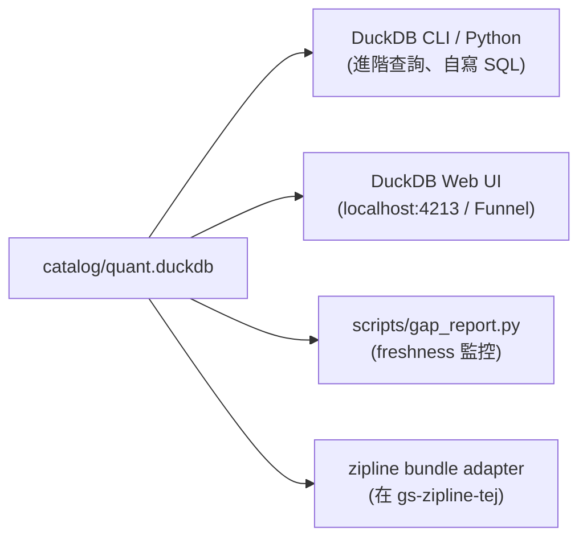

# DB / Catalog 概覽

QUANTDATA 的查詢介面**統一是 DuckDB**。檔案 `catalog/quant.duckdb` 是入口，內含 36 個 persistent views，分別指向 silver parquet、gold parquet、reference parquet、以及 bronze 的 FinMind sqlite。

## 為什麼是 DuckDB

| 訴求 | DuckDB 怎麼回應 |
|---|---|
| 單機、無 server、無權限管理 | embedded、檔案直接讀；不需要 daemon / port |
| 跨 parquet 大幅 scan 要快 | columnar engine + zstd + dictionary + row-group skip；6.6M 列 stock_bars `MAX(date)` < 100ms |
| 同時讀 parquet + sqlite + csv | `parquet_scan` / `sqlite_scan` / `read_csv_auto` 三種 scanner native |
| 跟 Polars / pandas 互通 | `con.execute(...).fetchdf()` 一行轉 pandas；`.pl()` 轉 polars |
| 別讓 schema 變動就崩 | DuckDB 1.5+ view 容忍底層 parquet schema 添欄；只有重命名/砍欄會炸 |

## 一個檔案，三個用法



| 用法 | 進入點 | 角色 |
|---|---|---|
| **DuckDB CLI** | `~/.local/bin/duckdb catalog/quant.duckdb` | 互動 SQL、跑 ad-hoc analytics |
| **Python (duckdb 套件)** | `duckdb.connect('catalog/quant.duckdb', read_only=True)` | 寫 script、ETL、寫進 polars / pandas |
| **DuckDB Web UI** | `duckdb -ui catalog/quant.duckdb` 然後 [localhost:4213](http://localhost:4213) | 圖形介面、適合人工 explore；見 [DuckDB Web UI](../ui/duckdb-ui.md) |

## 36 個 views 分類

| 類別 | View 數量 | 代表 view |
|---|---:|---|
| **股票日 K + 衍生** | 5 | `bars_1d`、`tw_stock_bars`、`stock_factor_daily` |
| **股票流量（三大法人 / 融資券 / 集保）** | 5 | `tw_inst_stock_daily`、`tw_margin_daily`、`tw_chip_dist_daily` |
| **期貨 / 期 / 選衍生** | 6 | `tw_inst_futures_daily`、`tw_inst_futures_full_daily`、`tw_futures_large_trader_daily`、`stock_futures_continuous_d`、`tx_continuous_d`、`mtx_continuous_d` |
| **選擇權** | 1 | `txo_daily_features`（更多在 silver 待暴露） |
| **基本面** | 4 | `fundamentals_q`、`revenue_monthly`、`accounting_raw`、`cash_dividend_events` |
| **總體 / 跨市場** | 2 | `macro_daily`、`cross_market_features` |
| **股票事件 / 屬性** | 4 | `tw_stock_trading_attrs_daily`、`tw_stock_futures_corp_actions`、`security_attrs`、`tw_inst_market_daily` |
| **FinMind bronze view** | 8 | `finmind_stock_price`、`finmind_stock_price_norm`、`finmind_stock_price_adj_norm`、`finmind_stock_info`、`finmind_stock_info_with_warrant`、`finmind_trading_date`、`finmind_stock_week_price`、`finmind_stock_price_adj` |
| **QC / 對帳** | 1 | `qc_stock_price_diff` |
| **Reference** | 3 | `symbol_map`、`contract_specs`、`calendar_xtai` |

詳細逐 view schema 與 row count 見 [Catalog views](views.md)。

## 跑你第一個 query

=== "CLI"

    ```bash
    ~/.local/bin/duckdb catalog/quant.duckdb -c \
      "SELECT trading_date, close FROM tw_stock_bars WHERE symbol='2330' ORDER BY trading_date DESC LIMIT 5"
    ```

=== "Python"

    ```python
    import duckdb
    con = duckdb.connect("catalog/quant.duckdb", read_only=True)
    df = con.execute("""
        SELECT trading_date, close
        FROM tw_stock_bars
        WHERE symbol='2330'
        ORDER BY trading_date DESC
        LIMIT 5
    """).fetchdf()
    print(df)
    ```

=== "Polars"

    ```python
    import duckdb
    con = duckdb.connect("catalog/quant.duckdb", read_only=True)
    pl_df = con.execute("SELECT * FROM tw_stock_bars WHERE symbol='2330'").pl()
    ```

## 安全規則

- **任何 production code 開連線都帶 `read_only=True`** — 預防誤 INSERT。
- 寫入 catalog 的 script 必須在 commit 前**先備份** `catalog/quant.duckdb` → `catalog/quant.duckdb.bak_<ts>`（看 `git log` 有大量 `*.bak_*` 範例）。
- 同一時間**只有一個 writer**：DuckDB 對單檔強制 OS-level lock。寫鎖被卡住時用 `fuser catalog/quant.duckdb` / `lsof` 找 holder。
- 別把 catalog DB push 進 git：`.gitignore` 已把 `catalog/**` 排除（只留 `.gitkeep`）。

更多 troubleshooting 見 [常見問題](../ops/troubleshooting.md)。
