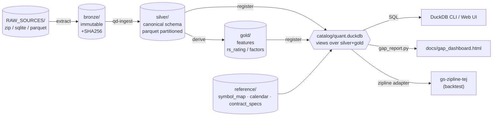

# QUANTDATA 文檔

> **狀態**：與 `main` 同步，每次 commit 由 GitHub Actions 自動重新發佈。
> **內容範圍**：QUANTDATA — 台股 / 期貨 / 選擇權 量化資料 medallion lakehouse 的 **架構 / DB / UI / Ops** 四大支柱。
> **不涵蓋**：個別策略原始碼（在 `gs-strategy/`）、回測引擎（在 `gs-zipline-tej/`）；本站只談「資料怎麼來、怎麼存、怎麼查」。

---

## 這是什麼？

QUANTDATA 是一個 single-machine **medallion lakehouse**，把多來源台股 / 期 / 選 原始資料統一成可被 DuckDB 直接查的 columnar layout。

```
RAW 原檔        →  bronze 不可變           →  silver canonical schema  →  gold 因子 / features
(zip / csv /        (parquet / sqlite,         (canonical schema:           (research-ready,
 sqlite / parquet)   immutable, 含 SHA256)      bars / flows / fundamentals / dervied features)
                                              macro)
```

主要來源：

| 來源 | 介面 | 涵蓋 |
|---|---|---|
| **TEJ** (Taiwan Economic Journal) | CSV 訂閱包 + REST API（`fetch_tej.py`） | 個股日 K + 三大法人 + 融資券 + 季報 + 月營收 + 期貨 + 大額交易人；2010-至今 |
| **TAIFEX** | 公開頁面直抓（自定 scraper） | 期貨 / 選擇權三大法人、未沖銷部位 |
| **FinMind** | 一次性 sqlite snapshot（2.5 GB） | 台股 OHLCV 2000-2026、興櫃、還原權息（與 TEJ 互為 cross-check） |
| **histdata / yfinance** | 一次性 parquet | 美股 / 商品 1min K（NQ/ES/GC）、VIX / 美元指數 |

文檔站把整套系統拆成四條閱讀路線：

<div class="grid cards" markdown>

- :material-sitemap: **[架構](architecture/overview.md)**

    Medallion 三層分工、目錄結構、資料流圖。

- :material-database: **[DB / Catalog](db/overview.md)**

    DuckDB catalog 裡有哪些 view、canonical schema、FinMind 整合、QC 對帳 view。

- :material-monitor-dashboard: **[UI](ui/overview.md)**

    DuckDB Web UI、gap 新鮮度 dashboard、Tailscale Funnel 遠端 share link。

- :material-wrench: **[Ops](ops/install.md)**

    安裝、`daily_refresh.sh` 編排、cron 排程、手動 ingest、踩雷指南。

</div>

---

## 快速跑起來

=== "Linux / WSL2"

    ```bash
    cd /home/kevin/gs-scraper/QUANTDATA
    python3 -m venv .venv && .venv/bin/pip install -e ".[ingest,dev]"
    .venv/bin/python -c "import duckdb; print(duckdb.connect('catalog/quant.duckdb', read_only=True).execute('SELECT COUNT(*) FROM bars_1d').fetchone())"
    ```

=== "Daily refresh"

    ```bash
    bash scripts/daily_refresh.sh            # 全跑
    bash scripts/daily_refresh.sh --dry-run  # 看每步要做什麼
    ```

=== "Gap dashboard"

    ```bash
    .venv/bin/python scripts/gap_report.py --format all
    explorer.exe docs/gap_dashboard.html      # WSL → Windows 開
    ```

完整環境矩陣與安裝細節見 [操作手冊 / 安裝](ops/install.md)。

---

## 系統一覽



每個方塊在 [架構 / 系統地圖](architecture/overview.md) 都有對應頁面。

---

## 文檔站怎麼維護？

- **手動編輯**：直接改 `docs-site/**/*.md`，commit 即上線。
- **自動發佈**：GitHub Actions workflow `.github/workflows/docs.yml` 監聽 `main` 分支 + `docs-site/` / `mkdocs.yml` / `scripts/` / `src/`，每次 push 都會：
    1. `pip install mkdocs==1.6.1 mkdocs-material==9.7.6`
    2. `mkdocs build --strict`
    3. push 到 `gh-pages` branch
- **本機預覽**：`.venv/bin/mkdocs serve -a 127.0.0.1:8080`（先 `pip install mkdocs mkdocs-material`），存檔即重整。

更多見 [變更紀錄](changelog.md)。
