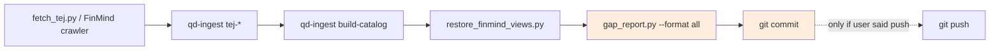

# 自動化（Agents & 全域 skill）

QUANTDATA 周邊有三個自動化資產，都是「人類常忘記做的尾段」打包成可重用的觸發：

| 名稱 | 範圍 | 何時用 |
|---|---|---|
| `incremental-crawler` | QUANTDATA repo-scoped agent | 跑增量爬蟲 / 抓最新 TEJ / refresh FinMind 時 |
| `goldify-100pct` | QUANTDATA repo-scoped agent | silver 滿格 100% 完整度但還沒升級到 gold 時。詳見 [Goldify routine](goldify-routine.md) |
| `/update-doc` | 全域 slash command（所有 repo 可用） | 文檔網站落後最新 commit 時 |

---

## `incremental-crawler` — repo agent

檔案：`.claude/agents/incremental-crawler.md`

### 作用

把「爬資料 → ingest → catalog rebuild → restore views → regen gap_dashboard → commit」這串綁成一個原子單元。**最關鍵**：強制爬完 regen `gap_dashboard.html`（local + docs-site mirror），不可省略。

### 觸發

任何時候對話內出現「跑增量爬蟲 / 抓最新 TEJ / refresh FinMind / append-since-silver / 更新 silver / 補洞 / 爬某個 dataset」等情境，Claude Code 會自動 route 到這個 agent。

### 標準流程



紅色標記的兩個 step（regen + commit）**不可省略**。

### 不要做的事

- 不主動 `git push`，除非使用者明確要求觸發 docs.yml workflow
- 不省略 dashboard regen，**任何理由都不行**
- 不去動 `bronze/` 既有檔
- 不把 fetch_tej.py CSV 輸出直接丟進 silver/（那是 qd-ingest 的工作）

完整 spec 見 `.claude/agents/incremental-crawler.md`。

---

## `/update-doc` — 全域 slash command

檔案：
- `~/.claude/skills/update-doc/SKILL.md`（full spec）
- `~/.claude/commands/update-doc.md`（slash entry）

### 作用

在**任何 repo** 執行 `/update-doc`，根據該 repo 從上次 doc 更新到現在的 commits，自動：

1. 偵測 doc 框架（MkDocs / Docusaurus / VitePress / Jekyll）
2. 跑 strict build，先把現有 build error 修掉
3. 對比 git log 找出有 source 變動但 doc 沒跟上的領域，**提案**要改的頁面（不亂改）
4. regen 自動產生的 dashboard / coverage report（如果 repo 有）
5. 寫 changelog（如果 repo 有）
6. commit 為 `docs: refresh doc-site to match HEAD (<short>)`
7. **不**自動 push（除非使用者明確要求）

### 用法

```bash
/update-doc                 # 全 repo 掃描
/update-doc focus=db        # 只關心 db 相關
/update-doc since=v1.2.0    # 從某 tag/commit 開始
/update-doc dry-run         # 列計畫不執行
```

### 適用 repo

framework-agnostic，目前支援：

| 偵測檔 | 框架 | build |
|---|---|---|
| `mkdocs.yml` | MkDocs | `mkdocs build --strict` |
| `docusaurus.config.*` | Docusaurus | `npm run build` |
| `.vitepress/config.*` | VitePress | `npm run docs:build` |
| `_config.yml` + `theme:` | Jekyll | `bundle exec jekyll build` |
| 都沒有 | (scaffold mode) | 推薦先 scaffold MkDocs |

### 與 `incremental-crawler` 的分工

| Scenario | 用誰 |
|---|---|
| 跑了增量爬蟲，想 reflect 進文檔 | `incremental-crawler` 自帶 dashboard regen，**不需要**再呼 `/update-doc` |
| 改了 source code（schema / API / module）但沒爬資料 | 用 `/update-doc` 把 doc-site 同步到 source 變動 |
| repo 不是 QUANTDATA、沒有 incremental-crawler agent | 永遠用 `/update-doc` |

完整 spec 見 `~/.claude/skills/update-doc/SKILL.md`。

---

## 為什麼這兩個都需要

| 痛點 | 解 |
|---|---|
| 爬完資料人忘了 regen dashboard，docs/gap_dashboard.html 落後幾天 | `incremental-crawler` 強制 regen |
| 改完 source code，docs-site 落後幾週 | `/update-doc` 找出該改的頁 |
| 在別的 repo 也想要一致的 doc 更新流程 | `/update-doc` 是 framework-agnostic 全域可用 |
| 每次都要記得 `mkdocs build --strict` 的版本 / flag | 兩個 skill 都已 bake into 流程 |

---

## 安裝 / 更新

`incremental-crawler` 跟 repo 走，git tracked 在 `.claude/agents/`，clone repo 就有。

`/update-doc` 是全域 skill，**不在任何 repo 內**。要把它複製到別台機器：

```bash
mkdir -p ~/.claude/skills/update-doc ~/.claude/commands
# 從備份 / 同步點拉檔到位
cp <backup>/SKILL.md      ~/.claude/skills/update-doc/SKILL.md
cp <backup>/update-doc.md ~/.claude/commands/update-doc.md
```

或在新機器 invoke `/skill 寫一個 update-doc skill 同這份 spec`，靠 `commands` skill 重生（不保證 100% 一樣，但接近）。
