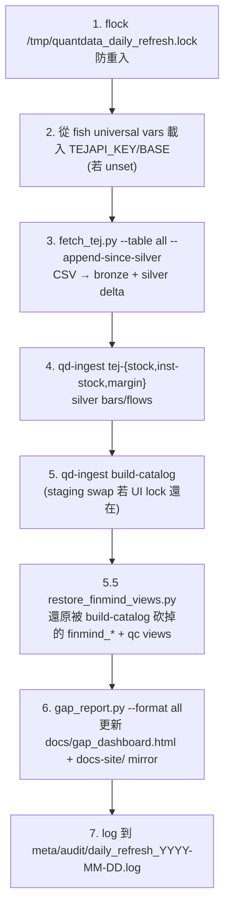

# 日常維運（daily refresh）

`scripts/daily_refresh.sh` 是 QUANTDATA 的「每日心跳」。它由 cron / systemd-timer 觸發，跑完整的「拉 TEJ → 寫 bronze → 寫 silver → 重建 catalog → 跑 gap_report」流線。

## 跑

```bash
bash scripts/daily_refresh.sh             # 全跑
bash scripts/daily_refresh.sh --dry-run   # 列每步要做的事，不執行
bash scripts/daily_refresh.sh --help      # 印說明
```

## 流線



!!! info "Step 3.5 — restore_finmind_views"

    `qd-ingest build-catalog` 從固定的 view DDL 集合重建 catalog，**不知道** FinMind sqlite snapshot 那 9 個 view 的存在，每次都會把它們砍掉。`scripts/restore_finmind_views.py` 自動 glob 最新的 `bronze/finmind/finmind_*.sqlite`，重建：

    - `finmind_stock_price` / `finmind_stock_price_norm`
    - `finmind_stock_price_adj` / `finmind_stock_price_adj_norm`
    - `finmind_stock_info` / `finmind_stock_info_with_warrant`
    - `finmind_trading_date` / `finmind_stock_week_price`
    - `qc_stock_price_diff`

    Step 3.5 標記為 non-fatal — 失敗會 log 但不中止 daily_refresh。

## Exit codes

| code | 意義 |
|---:|---|
| 0 | 全成功 |
| 1 | fetch 失敗（TEJ API down / 網路） |
| 2 | ingest 失敗（schema mismatch / disk full） |
| 3 | catalog rebuild 失敗 |
| 10 | locked（另一個 instance 還在跑） |
| 11 | missing `TEJAPI_KEY` |

cron 應把這些寫進 mail 或 healthcheck endpoint，否則 stale 都不會被發現。

## Idempotent 保證

設計上**重跑同一天無副作用**：

- `fetch_tej.py --append-since-silver` 先 `SELECT MAX(trading_date) FROM silver`，只抓那之後的
- 寫入 silver 用 `INSERT OR REPLACE`（partition-level overwrite）
- `qd-ingest` 內建 manifest dedup：用 `(source, file_path, sha256)` 為主鍵 skip 已 ingest 的檔
- `gap_report.py` 是純讀

所以 ① cron 卡住重跑、② 手動補跑、③ 兩個 cron entry 撞時間 — 都不會出問題。

## Lock 機制

```bash
exec 9>"/tmp/quantdata_daily_refresh.lock" || exit 10
flock -n 9 || exit 10        # non-blocking; 拿不到就 exit 10
```

兩個 instance 同時跑時，第二個會 exit 10 立刻退出，不會等。
這也是為什麼 cron 不會 cascade（每日 17:30 跑 + 18:00 又跑也沒事）。

## Log

每日一檔：

```
meta/audit/daily_refresh_2026-05-21.log
```

格式：

```
2026-05-21T08:30:01Z [INFO] daily_refresh.sh START
2026-05-21T08:30:01Z [INFO] TEJAPI_KEY loaded from fish universal vars
2026-05-21T08:30:02Z [INFO] fetch_tej.py --table all --append-since-silver
2026-05-21T08:33:14Z [INFO] fetch_tej: 1,684 stocks updated through 2026-05-21
2026-05-21T08:33:14Z [INFO] qd-ingest tej-stock
2026-05-21T08:34:51Z [INFO] qd-ingest tej-inst-stock
2026-05-21T08:35:33Z [INFO] qd-ingest tej-margin
2026-05-21T08:35:48Z [INFO] qd-ingest build-catalog (no UI lock)
2026-05-21T08:35:51Z [INFO] gap_report.py --format all
2026-05-21T08:35:58Z [INFO] daily_refresh.sh DONE exit=0 elapsed=357s
```

Log 不放進 git。`meta/**` 是 gitignored，除了 `meta/audit/*.jsonl` 例外（jsonl manifest 進版控）。

## 手動觸發特定步驟

如果只想跑某一步：

```bash
# 只拉 TEJ stock_daily 過去 7 天
.venv/bin/python scripts/fetch_tej.py --table stock_daily --backfill-from 2026-05-14

# 只 rebuild catalog（不抓資料）
.venv/bin/qd-ingest build-catalog

# 只重畫 gap dashboard
.venv/bin/python scripts/gap_report.py --format all
```

## TEJ API rate limit

TEJ 沒公布精確的 RPS 限制，但實測：

- 連續 30 requests/min 大致 OK
- 超過會偶發 429；`fetch_tej.py` 內建 exponential backoff，自動 retry 3 次

長期 backfill（例如歷史 10 年）建議夜間跑（API 較空）。

## 跟其他 session 共處

當另一個 Claude session（如 `quantdata-scraper`）也在跑 ingest 時：

1. 用 `fuser catalog/quant.duckdb` 確認誰持有寫鎖
2. 若不重要的 reader（如 `duckdb -ui` 互動 session）→ 可以殺
3. 若是 active writer（另一個 ingest 在跑）→ 等它結束

詳見 [常見問題](troubleshooting.md) 的「寫鎖怎麼處理」。

## SLA 與 alerting

目前**沒接 alert**。看 dashboard：每天瀏覽 `docs/gap_dashboard.html`，若 STALE > 0 自己跑對應 fetch。

未來規劃：
- failed daily_refresh → email / Slack notify
- gap dashboard 內嵌 → Slack incoming webhook
- 視 SLA 嚴重度自動建 GitHub issue
