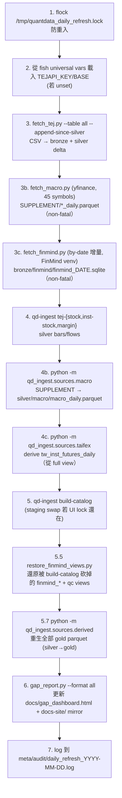

# 日常維運（daily refresh）

`scripts/daily_refresh.sh` 是 QUANTDATA 的「每日心跳」。它由 cron / systemd-timer 觸發，跑完整的「拉 TEJ → 寫 bronze → 寫 silver → 重建 catalog → 跑 gap_report」流線。

## 跑

```bash
bash scripts/daily_refresh.sh             # 全跑
bash scripts/daily_refresh.sh --dry-run   # 列每步要做的事，不執行
bash scripts/daily_refresh.sh --help      # 印說明
```

## 流線



!!! info "Step 1.5 / 2.5 — macro scraper（2026-05-27 加入）"

    `macro_daily` silver 來自 `RAW_SOURCES/SUPPLEMENT/<cat>/*_daily.parquet`，過去沒有任何排程刷新，導致 `macro_daily` → `macro_factors` gold 長期 STALE。

    - **Step 1.5**：`scripts/fetch_macro.py` 用 yfinance append-since-last 把 45 個 macro symbol（VIX / USDTWD / WTI / 美 10Y / SPX / SOX / 各國指數 / 商品 / 信用 ETF）刷到當日。標 **non-fatal** — Yahoo 可能 rate-limit 或從本機連不上，不該中止 TEJ 主線。`--dry-run` 時只印計畫。
    - **Step 2.5**：`python -m qd_ingest.sources.macro` 把剛刷新的 SUPPLEMENT parquets aggregate 進 `silver/macro/macro_daily.parquet`。必須排在 step 3.7 derived rebuild 之前，`macro_factors` gold 才讀得到當日 macro。同樣 non-fatal。

    手動補跑：`./.venv/bin/python scripts/fetch_macro.py`（可加 `--only VIX,SPY` 限定 symbol）→ `python -m qd_ingest.sources.macro` → `python -m qd_ingest.sources.derived`。

!!! info "Step 1.7 — FinMind by-date 增量（2026-05-27 加入）"

    5 個 FinMind-derived view 過去靠手動 fetch，常停在數天前（INFO）。`scripts/fetch_finmind.py` 把缺的交易日補上：

    - **跑在 FinMind crawler 的 venv**（`$FINMIND_REPO/.venv`，預設 `../FINMIND資料集`），因為它需要那個 repo 的 client 依賴；找不到 venv 就 skip + WARN。
    - 用 FinMind **by-date bulk** 端點（不帶 `data_id`，單呼叫回整個市場單日）**逐日**補 `[max_date..today]`，而非 catalog 的 `per_stock`（~3,088 檔 × 2 ≈ 4h）。增量數秒完成。
    - rows 過濾到 twse/tpex/emerging universe；寫完 `wal_checkpoint` 後 `cp` live sqlite → `bronze/finmind/finmind_<DATE>.sqlite` + sha256，GC 留最新 5 份。
    - 產出的 snapshot 被 **step 3.5** `restore_finmind_views` glob 為最新 → **step 3.7** materialize finmind/qc gold 自動跟上。

    手動補跑：`FINMIND_REPO=../FINMIND資料集 ../FINMIND資料集/.venv/bin/python scripts/fetch_finmind.py`（`--dry-run` 先看計畫）。

!!! info "Step 2.6 — derive tw_inst_futures_daily（2026-05-27 加入）"

    2 個 P0 view（`tw_inst_futures_daily` + snapshot）過去靠手動 TAIFEX dump，常 STALE。改成從 **已經每天 fresh 的 `tw_inst_futures_full_daily`**（TEJ `TWN/AFINST`，step 1 拉）衍生：

    - `python -m qd_ingest.sources.taifex`（`derive_inst_futures_daily`）filter 9 個 code → 3 商品（TXF/MXF/TXO）× 3 法人（dealer/sitc/fii），dedup keep-last，重算 60d net-OI z-score，覆寫 `silver/flows/tw_inst_futures_daily`。
    - **不需要 TAIFEX 官網爬蟲** —— full view 是超集且權威，逐筆驗證相同。
    - 排在 step 3.7 derived gold rebuild 之前，`materialize_tw_inst_futures_daily_snapshot` 才讀得到 fresh silver。non-fatal。

    手動補跑：`.venv/bin/python -m qd_ingest.sources.taifex`（`--dry-run` 先看）。

!!! info "Step 3.7 — rebuild derived gold（2026-05-27 加入）"

    沒有這步時，gold parquet（`stock_factor_daily` / `inst_flow_factors` / `margin_factors` / `futures_*` / `market_inst_aggregated` 等 17 支）會停在上次手動 `build_all()` 的日期，而 silver 每天往前 → 隔天 dashboard 上這些 derived gold 全變 INFO（lag）。

    Step 3.7 跑 `python -m qd_ingest.sources.derived`（= `build_all()`，~40s）讓 gold 每天自動跟著 silver 重生。標記 **non-fatal**：多數 builder 直接讀 silver parquet（不受 catalog 寫鎖影響），少數讀 catalog 的 `materialize_*` 若遇 DuckDB UI 鎖可能失敗，但不該中止整個 refresh。

!!! info "Step 3.5 — restore_finmind_views"

    `qd-ingest build-catalog` 從固定的 view DDL 集合重建 catalog，**不知道** FinMind sqlite snapshot 那 9 個 view 的存在，每次都會把它們砍掉。`scripts/restore_finmind_views.py` 自動 glob 最新的 `bronze/finmind/finmind_*.sqlite`，重建：

    - `finmind_stock_price` / `finmind_stock_price_norm`
    - `finmind_stock_price_adj` / `finmind_stock_price_adj_norm`
    - `finmind_stock_info` / `finmind_stock_info_with_warrant`
    - `finmind_trading_date` / `finmind_stock_week_price`
    - `qc_stock_price_diff`

    Step 3.5 標記為 non-fatal — 失敗會 log 但不中止 daily_refresh。

## Exit codes

| code | 意義 |
|---:|---|
| 0 | 全成功 |
| 1 | fetch 失敗（TEJ API down / 網路） |
| 2 | ingest 失敗（schema mismatch / disk full） |
| 3 | catalog rebuild 失敗 |
| 10 | locked（另一個 instance 還在跑） |
| 11 | missing `TEJAPI_KEY` |

cron 應把這些寫進 mail 或 healthcheck endpoint，否則 stale 都不會被發現。

## Idempotent 保證

設計上**重跑同一天無副作用**：

- `fetch_tej.py --append-since-silver` 先 `SELECT MAX(trading_date) FROM silver`，只抓那之後的
- 寫入 silver 用 `INSERT OR REPLACE`（partition-level overwrite）
- `qd-ingest` 內建 manifest dedup：用 `(source, file_path, sha256)` 為主鍵 skip 已 ingest 的檔
- `gap_report.py` 是純讀

所以 ① cron 卡住重跑、② 手動補跑、③ 兩個 cron entry 撞時間 — 都不會出問題。

## Lock 機制

```bash
exec 9>"/tmp/quantdata_daily_refresh.lock" || exit 10
flock -n 9 || exit 10        # non-blocking; 拿不到就 exit 10
```

兩個 instance 同時跑時，第二個會 exit 10 立刻退出，不會等。
這也是為什麼 cron 不會 cascade（每日 17:30 跑 + 18:00 又跑也沒事）。

## Log

每日一檔：

```
meta/audit/daily_refresh_2026-05-21.log
```

格式：

```
2026-05-21T08:30:01Z [INFO] daily_refresh.sh START
2026-05-21T08:30:01Z [INFO] TEJAPI_KEY loaded from fish universal vars
2026-05-21T08:30:02Z [INFO] fetch_tej.py --table all --append-since-silver
2026-05-21T08:33:14Z [INFO] fetch_tej: 1,684 stocks updated through 2026-05-21
2026-05-21T08:33:14Z [INFO] qd-ingest tej-stock
2026-05-21T08:34:51Z [INFO] qd-ingest tej-inst-stock
2026-05-21T08:35:33Z [INFO] qd-ingest tej-margin
2026-05-21T08:35:48Z [INFO] qd-ingest build-catalog (no UI lock)
2026-05-21T08:35:51Z [INFO] gap_report.py --format all
2026-05-21T08:35:58Z [INFO] daily_refresh.sh DONE exit=0 elapsed=357s
```

Log 不放進 git。`meta/**` 是 gitignored，除了 `meta/audit/*.jsonl` 例外（jsonl manifest 進版控）。

## 手動觸發特定步驟

如果只想跑某一步：

```bash
# 只拉 TEJ stock_daily 過去 7 天
.venv/bin/python scripts/fetch_tej.py --table stock_daily --backfill-from 2026-05-14

# 只 rebuild catalog（不抓資料）
.venv/bin/qd-ingest build-catalog

# 只重畫 gap dashboard
.venv/bin/python scripts/gap_report.py --format all
```

## TEJ API rate limit

TEJ 沒公布精確的 RPS 限制，但實測：

- 連續 30 requests/min 大致 OK
- 超過會偶發 429；`fetch_tej.py` 內建 exponential backoff，自動 retry 3 次

長期 backfill（例如歷史 10 年）建議夜間跑（API 較空）。

## 跟其他 session 共處

當另一個 Claude session（如 `quantdata-scraper`）也在跑 ingest 時：

1. 用 `fuser catalog/quant.duckdb` 確認誰持有寫鎖
2. 若不重要的 reader（如 `duckdb -ui` 互動 session）→ 可以殺
3. 若是 active writer（另一個 ingest 在跑）→ 等它結束

詳見 [常見問題](troubleshooting.md) 的「寫鎖怎麼處理」。

## SLA 與 alerting

目前**沒接 alert**。看 dashboard：每天瀏覽 `docs/gap_dashboard.html`，若 STALE > 0 自己跑對應 fetch。

未來規劃：
- failed daily_refresh → email / Slack notify
- gap dashboard 內嵌 → Slack incoming webhook
- 視 SLA 嚴重度自動建 GitHub issue
