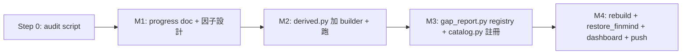

# Goldify routine（silver → gold 自動化）

> Agent：`.claude/agents/goldify-100pct.md`
> Audit script：`scripts/goldify_audit.py`
> 設計來源：`docs/progress-goldify-agent.md`

QUANTDATA medallion 架構裡，任何含有 silver / bronze / raw 資料但**沒有 gold backlink** 的 view 都是 goldification 對象——不只「100% 完整度的 view」。本頁說明把這流程自動化的兩支工具：**audit script** 偵測 candidates；**agent / slash command** 把 audit + builder + registry + dashboard 串起來。

## 什麼算 "candidate"？

> 2026-05-26 範圍更新：原本 audit 只挑 100% 完整度的 view，已擴大為「**任何有資料但沒 gold backlink 的 view**」。原因：使用者目標是 100% catalog coverage of gold（不是 100% per-view completeness）。STALE 的 silver 也該 goldify，gold 就是「截至 silver max_date」的快照。

凡是同時滿足下面 3 條的 catalog view：

1. **`row_count > 0`**（在 catalog 內查得到至少 1 列）
2. **`scripts/gap_report.py` 的 DATASETS registry 裡 `gold_paths` 為空 tuple**（還沒 backlink 任何 gold parquet）
3. 在 catalog 中可 `DESCRIBE` 出 schema（view 存在、不是 ghost）

完整度（severity / lag_days）**不是過濾條件**，但會在報告中顯示，讓你知道哪些 cand 是「100% fresh」、哪些是「STALE 但有資料」。

要回到舊行為（只 audit 100% 完整度的 view），用 `--complete-only` flag：

```bash
.venv/bin/python scripts/goldify_audit.py --complete-only
```

## 用法

### 1. Audit — 看現在還有沒有 ripe candidate

```bash
.venv/bin/python scripts/goldify_audit.py \
    --json meta/audit/goldify_audit.json \
    --markdown reports/goldify_audit.md
```

輸出有 3 種：

| 形式 | 目的 |
|---|---|
| stdout (text) | 人類快速看 |
| `--json` | 下游程式吃（CI / agent）|
| `--markdown` | 直接貼進 progress doc 的「複盤現狀」段 |

當前狀態（截至 2026-05-26）：

```
✅ goldify_audit: no views with non-gold data found. Catalog is fully goldified.
```

### 2. Slash command `/goldify-100` — 一鍵 loop 直到收斂（**最常用**）

在 Claude Code 對話框輸入：

```
/goldify-100
```

行為：

1. 先 `goldify_audit` → 若 0 candidates 直接 ✅ 退出
2. 否則跑一輪 4-milestone 流程（plan / builders / registry / dashboard）
3. **跑完後再 audit**；若仍有 ripe candidates（前一輪 goldify 解鎖的下游）→ 再跑一輪
4. 直到 `0 candidates` 或 5 輪上限 / 連續 2 輪 candidates 數沒下降

每輪都有獨立 progress doc + 4 個 commits（`Mn-iter<N>: ...`）；**push 只發生在收斂時**。

### 3. Agent 觸發 — 自然語言路由（單次跑）

對 Claude Code 說任何下面這類話，會 route 到 `goldify-100pct` agent（單輪、不 loop）：

- 「跑 goldify routine」
- 「dashboard 上 silver 100% 但 gold 空白的 view 補一補」
- 「audit 一下還有沒有沒 goldify 的」
- 「100% complete 還沒變 gold 的繼續處理」

Agent 強制執行 4 個 milestone（每個一個 commit）：



## Factor template 對應表

audit script 依 silver schema 自動推薦 builder 樣板，對應 9 個既有 builder：

| template | 觸發 schema 特徵 | 樣板 builder | 既有 gold 範例 |
|---|---|---|---|
| `time_series_bar` | OHLC + volume | `build_stock_factor_daily` | `stock_factor_daily` |
| `flow_rolling` | `*_net_lot` 欄 | `build_inst_flow_factors` | `inst_flow_factors` |
| `balance_zscore` | margin / short balance | `build_margin_factors` | `margin_factors` |
| `per_entity_oi` | `identity_code` + OI | `build_futures_inst_factors` | `futures_inst_factors` |
| `event_panel` | ex_date / adjust_date | `build_dividend_calendar` | `dividend_calendar` |
| `boolean_panel` | ≥5 個 `is_*` flag | `build_stock_attrs_status` | `stock_attrs_status` |
| `pit_fundamentals` | publish_date + EPS/revenue | `build_fundamentals_pit` | `fundamentals_pit` |
| `view_materialize` | 純 view（無 silver） | `materialize_qc_snapshot` | `qc_stock_price_diff_snapshot` |
| `left_join_merge` | 多 view JOIN | `materialize_finmind_canonical` | `finmind_price_canonical` |

template 是 **best-guess**，不是強制。Agent 會把它寫進 progress doc，使用者可以改。

## 為什麼自動化這個？

歷史上手動 goldify 跑過 3 輪：

| 輪次 | commits | 新 gold |
|---|---|---|
| Round 1 | `a8b6c55..6b71e93` | 1 個新 gold + 5 backlink |
| Round 2 | `1bcfce6..0c27ffa` | 7 個新 gold (margin/fundamentals_pit/futures_large_trader/futures_inst/stock_attrs/dividend/sf_adj) |
| Round 3 | `e936402..80e2f7e` | 3 個新 gold (futures_bar_factors/qc_snapshot/finmind_canonical) + 5 backlink |

每輪流程一模一樣（audit → 4 milestone）。包成 agent 後：

1. **未來再有 silver 滿格**，跑 audit 即可知道；不用人工掃 dashboard
2. **新人接手**也能照 template 對應自動仿既有 builder
3. **milestone-based commit** 強制單一 PR 可回滾
4. **dashboard 永遠是真相**（M4 不可省略）

## 不變式

- audit script 報 0 candidate 時，agent 不會動任何檔，安全 idempotent
- 每個 milestone 一個 commit，commit message 前綴 `Mn:` 便於 `git log` 一眼看出進度
- silver multi-ingest dedup（19% / 6–8% trading_attrs 等）在 gold builder 統一處理
- M4 永遠包含 `mkdocs build --strict` + dashboard regen + `restore_finmind_views.py`

## 與其他 agent 的關係

| 流程 | 觸發 agent |
|---|---|
| 抓新資料 → silver | `incremental-crawler` |
| silver 滿格 → gold | `goldify-100pct`（本頁） |
| 程式碼變 → docs 同步 | `/update-doc` |

三個 agent 串起來就是 daily refresh 的完整 pipeline，但每一段都可單獨呼叫。
