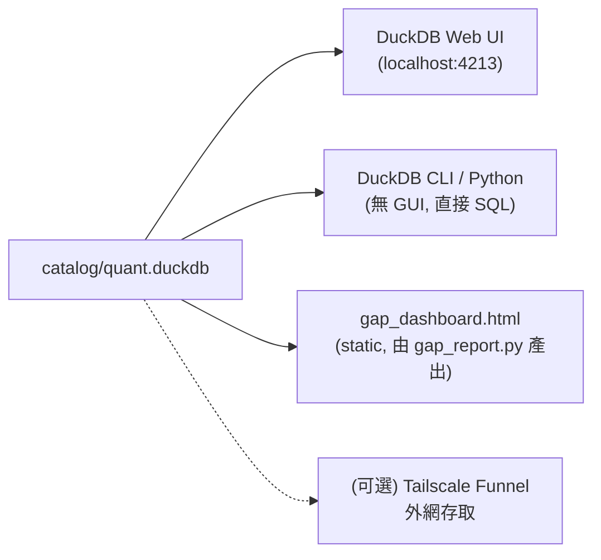

# UI 概覽

QUANTDATA 沒有自家 frontend；它提供三條看資料的路徑：

## 三條路徑比較

| 路徑 | 目的 | 何時用 |
|---|---|---|
| **[DuckDB Web UI](duckdb-ui.md)** | 在瀏覽器跑 SQL、看圖表、看 schema | 人類 explore、ad-hoc analytics |
| **DuckDB CLI / Python** | 腳本、ETL、batch query | production code、其他 repo 引用 |
| **[Gap dashboard](gap-dashboard.md)** | 看每張 view 的新鮮度 + 該跑什麼 fetch 指令 | 每日盯資料是不是 stale |

## 遠端 / 公開存取

預設**所有 UI 都只 bind `127.0.0.1`**，因為：

1. DuckDB UI 預設沒有 auth；任何拿到 URL 的人都能進
2. catalog 內含 TEJ 付費訂閱資料，公開可能違反 redistribution TOS
3. DuckDB process 環境有 `TEJAPI_KEY`，惡意 SQL 可能透過 UDF 嘗試讀取

要遠端用怎麼辦？三條：

| 選項 | 安全性 | 工作量 |
|---|---|---|
| **SSH tunnel** | 最高（憑 SSH 認證、不公開） | 0：`ssh -L 4213:localhost:4213 <host>` |
| **Tailscale Funnel** | 中（憑 tailnet ACL；HTTPS） | 中（DuckDB UI 還有 token 障礙，目前 WIP；見 [Funnel 頁](funnel.md)） |
| **自寫 FastAPI playground** | 可控（自己加 basic auth + read_only 連線） | 中（~80 LOC） |

完整討論見 [Tailscale Funnel 頁](funnel.md)。

## 工具版本

| 工具 | 版本 |
|---|---|
| DuckDB CLI | 1.5.2（`~/.local/bin/duckdb`） |
| Python `duckdb` 套件 | 1.5.2（`.venv/bin/pip show duckdb`） |
| Tailscale | 已安裝、已 login `tailffb0ce.ts.net` |
| ngrok | 已棄用（authtoken 跑不通） |

升級 DuckDB CLI / Python 套件**要同步**，否則 catalog 可能跨版本不相容（DuckDB 對檔案 layout 不保證向後相容）。
